# 使用指南 (Usage Guide)

## 1. 设置密码 (Set Password)

安装软件之后，在系统设置中设置密码，该密码用于加密ApiKey、oauthToken等重要信息。

After installing the software, set a password in the system settings. This password is used to encrypt important information such as API keys and OAuth tokens.

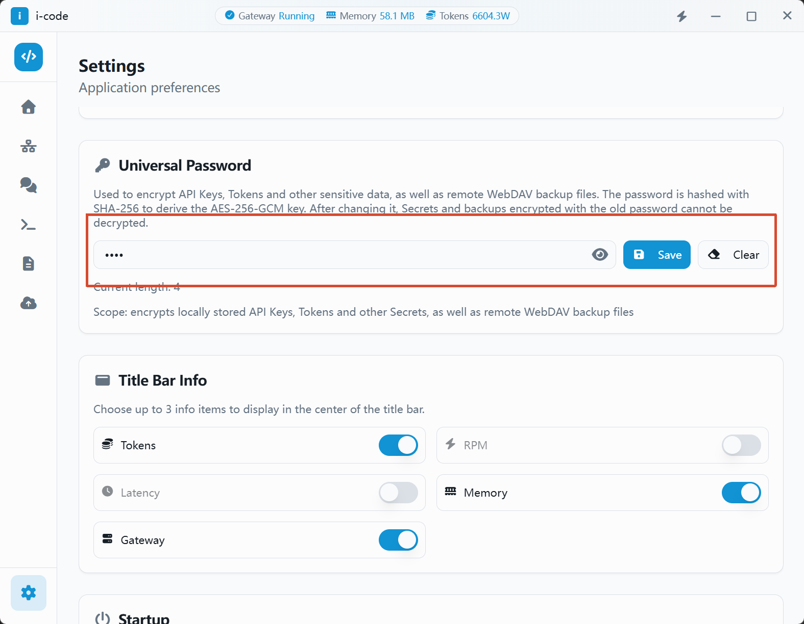

## 2. 开启网关并新增授权ApiKey (Start the Gateway and Add Authorized API Keys)

### 2.1. 开启网关 (Start the Gateway)

在网关设置中，开启网关鉴权、初始化默认莫要，最后打开网关（如果无法开启端口监听，请以管理员身份运行i-code）

In the gateway settings, enable gateway authentication and initialize the default key, then start the gateway (if the port cannot be bound, run i-code as administrator).

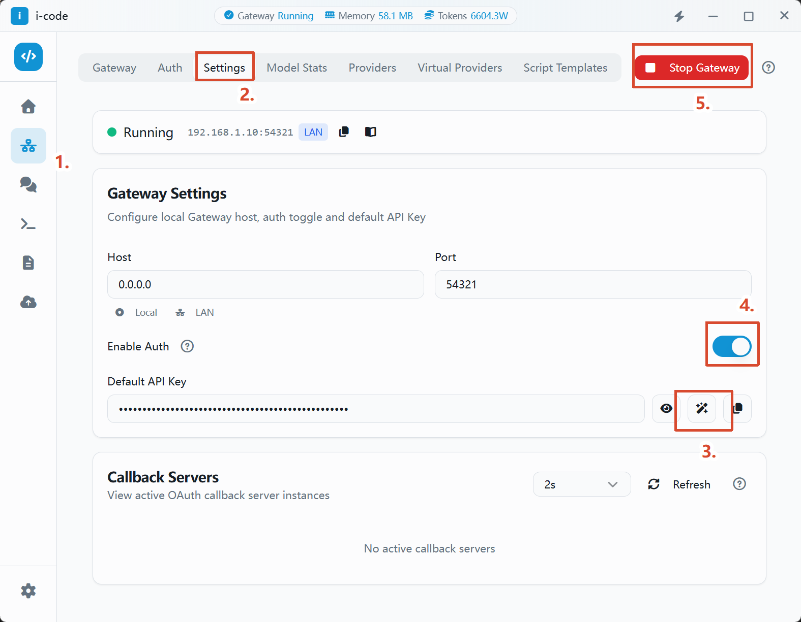

### 2.2. 新增授权ApiKey (Add Authorized API Keys)

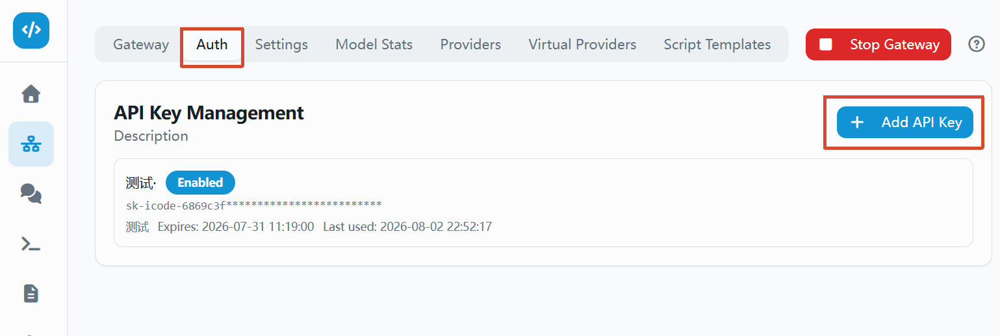

创建完成后，支持快速复制

After creation, you can quickly copy the key.

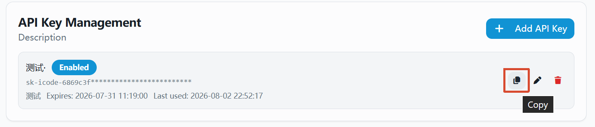

## 3. 新增供应商 (Add a Provider)

支持从预设中、手动方式新建供应商

You can create a provider from presets or manually.

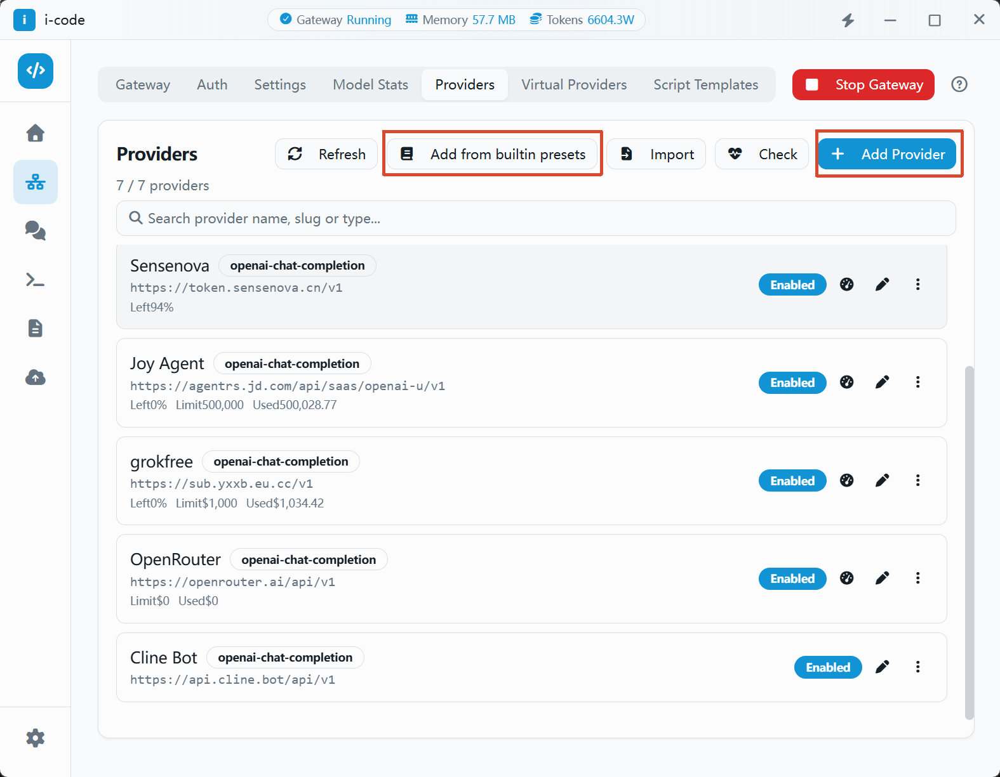

添加供应商时，先完成基础信息配置，以及供应商的**ApiKey**填写；然后保存

When adding a provider, first complete the basic information and fill in the provider's **API key**, then save.

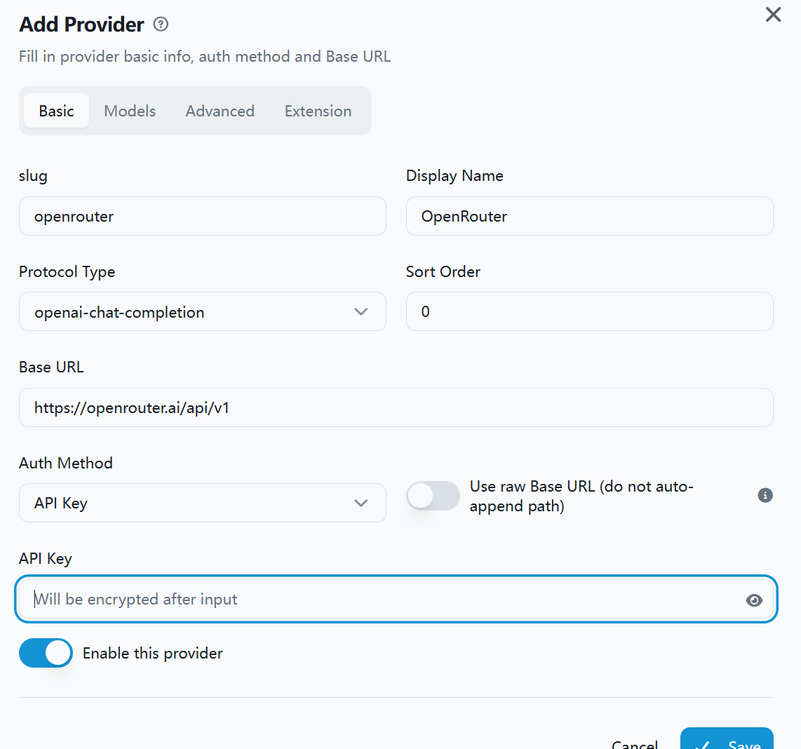

## 4. 添加模型 (Add Models)

必须先完成第三步骤的保存，在点击编辑供应商，进入模型界面；

You must first save step 3, then click "Edit Provider" to enter the models screen.

拉取官方模型列表

Fetch the official model list.

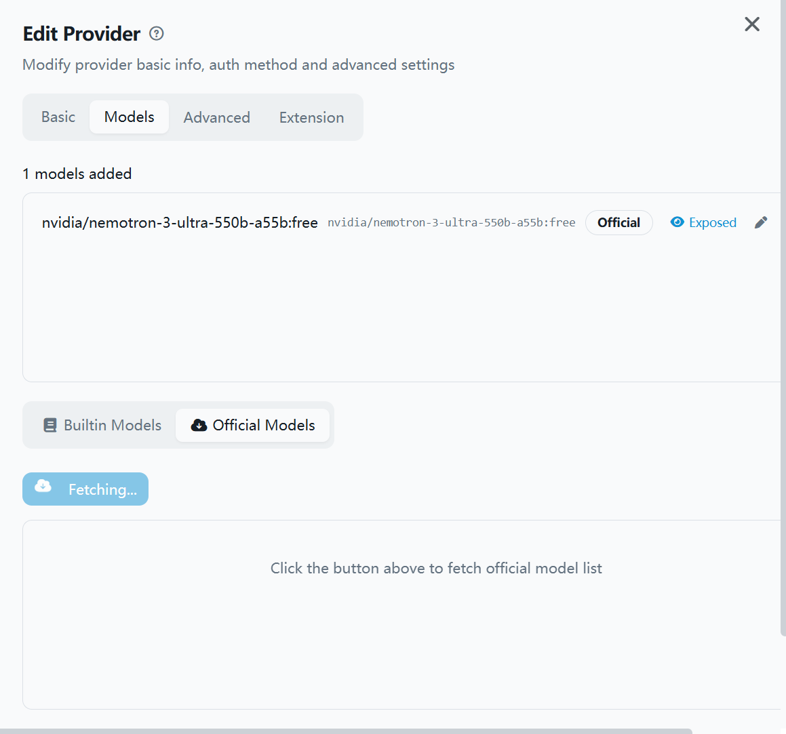

从官方模型中勾选，并添加

Select models from the official list and add them.

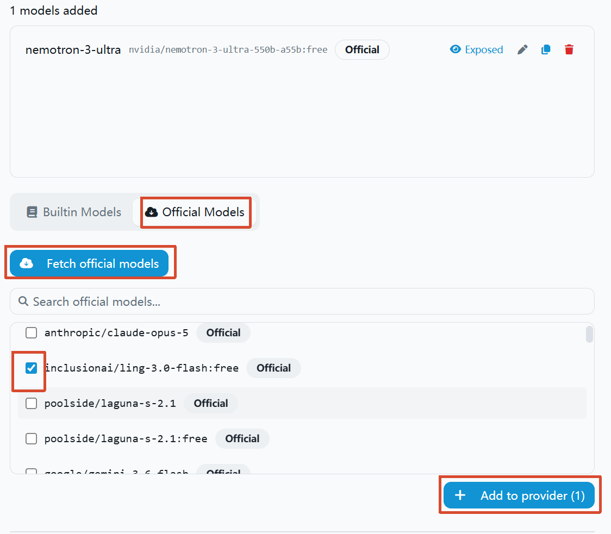

## 5. 高级设置 (Advanced Settings)

支持供应商级别的代理设置

Provider-level proxy settings are supported.

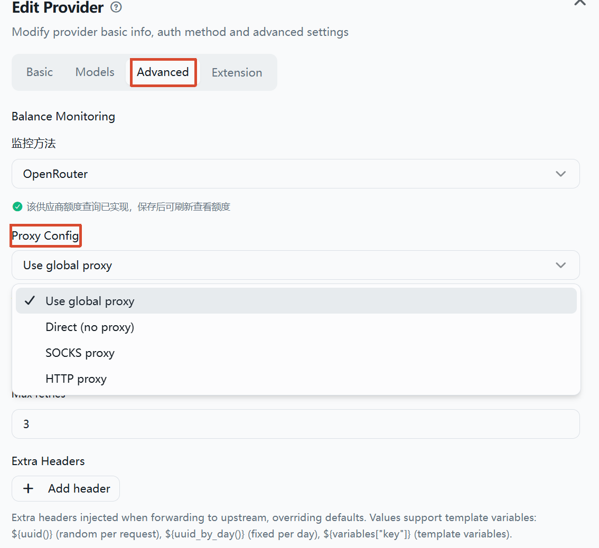

## 6. 在其他软件中使用 (Use with Other Software)

### 6.1. VsCode (Unify Chat Provider)

创建供应商

Create a provider.

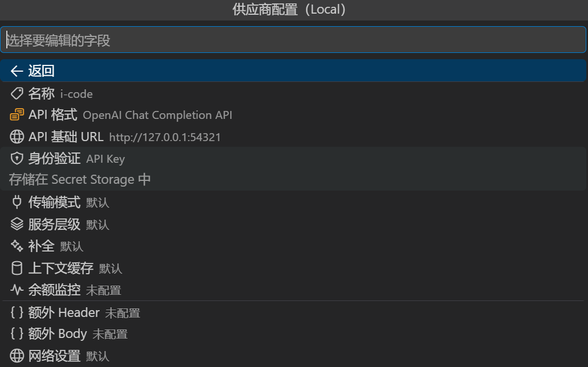

从官方模型列表拉取

Fetch the official model list.

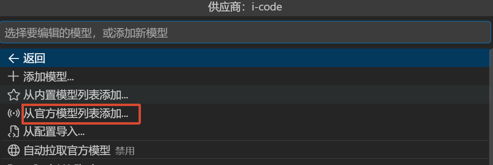

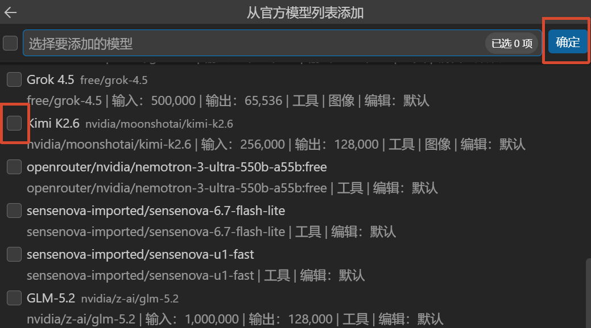