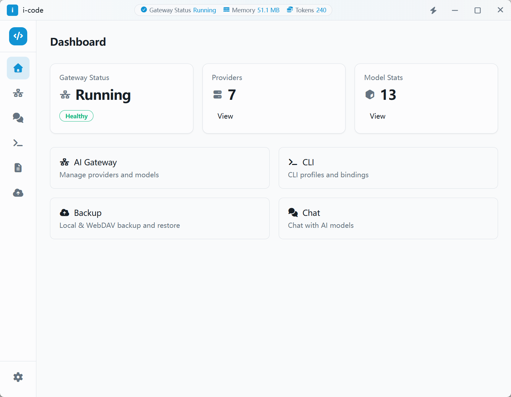
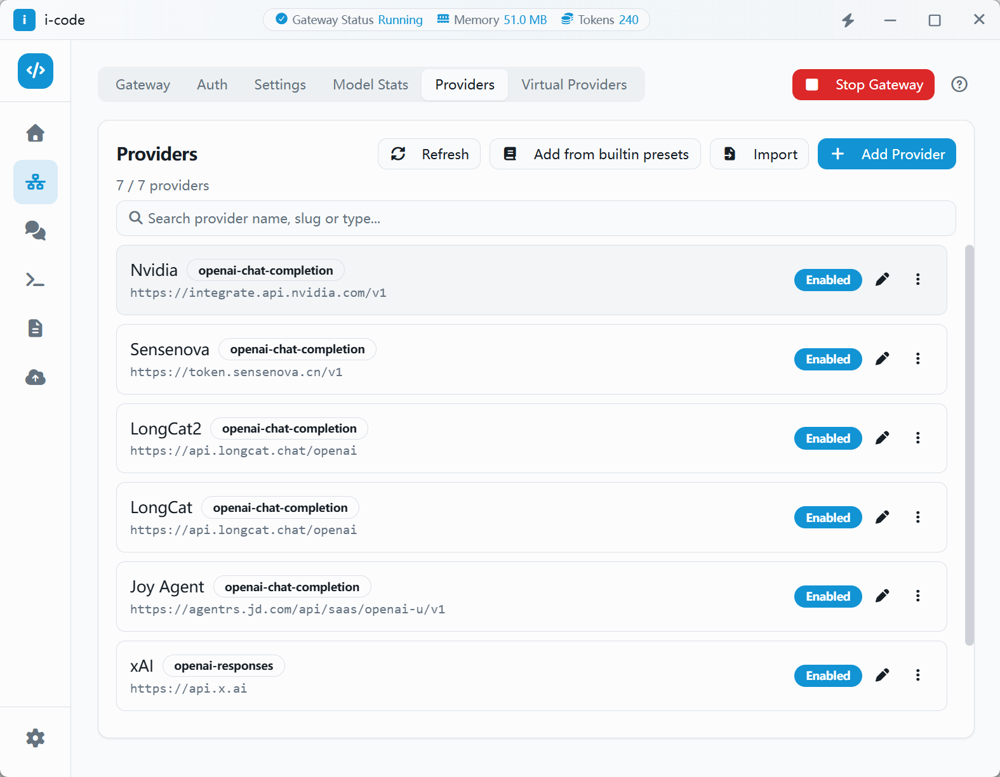
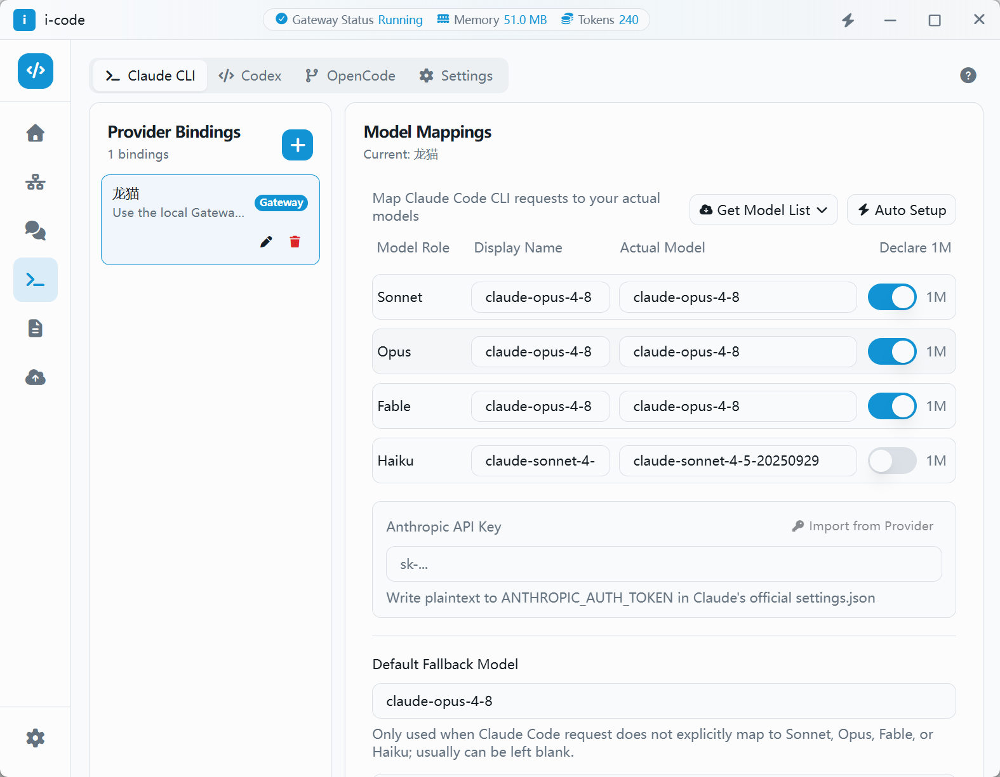
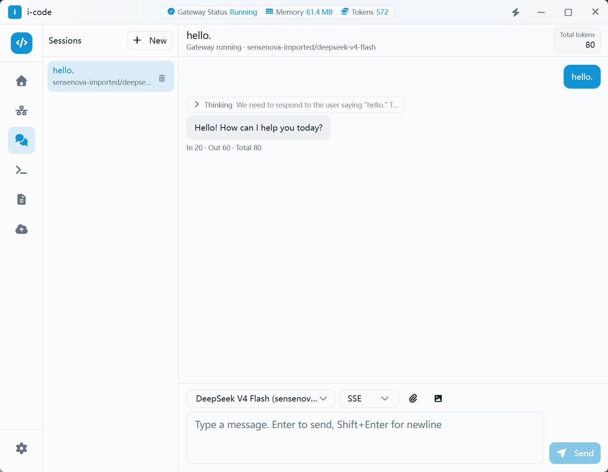

# i-code

<p align="center">
  
</p>

<p align="center">
  <strong>Local AI Gateway & CLI Configuration Management Center</strong>
</p>

<p align="center">
  <a href="https://github.com/xucux/i-code/releases">
    
  </a>
  
  
  
  
  <a href="./README.zh-CN.md">
    
  </a>
</p>

<p align="center">
  <a href="#features">Features</a> •
  <a href="#screenshots">Screenshots</a> •
  <a href="#tech-stack">Tech Stack</a> •
  <a href="#getting-started">Getting Started</a> •
  <a href="#development">Development</a> •
  <a href="#architecture">Architecture</a> •
  <a href="#security">Security</a> •
  <a href="./GUIDE.md">User Guide</a>
</p>

---

## Features

- **AI Gateway Management**: Centrally manage multiple LLM providers (OpenAI, Anthropic, Gemini, OpenRouter, etc.) with multi-protocol and authentication support.
- **Local API Gateway**: Expose a unified local API at `127.0.0.1:54321`, routing models via `{provider_slug}/{model_id}` format.
- **CLI Configuration Profiles**: Maintain profiles for Claude Code, Codex, Gemini CLI, and more. Route them directly to vendors or through the local gateway.
- **Chat Interface**: Built-in chat UI for sending messages, streaming responses, and viewing error bubbles with JSONL message storage.
- **Secret Encryption**: API keys are encrypted via AES-GCM and never persisted in plain text. Config files only store `$SECRET:{uuid}$` references.
- **Balance & Usage Monitoring**: Track provider balances and model call records.
- **Backup & Restore**: Local and WebDAV backup support with SQLite Online Backup API.
- **In-App Diagnostics**: Dual logging system for development traces and operational event logs.

## Screenshots


### Dashboard

<p align="center">
  
</p>


### AI Gateway Providers

<p align="center">
  
</p>


### CLI Profiles

<p align="center">
  
</p>


### Chat Interface

<p align="center">
  
</p>


## Tech Stack

| Layer | Technology |
|-------|------------|
| Desktop Framework | Tauri 2.x (Rust + WebView) |
| Frontend | React 19 + TypeScript 5 |
| Routing | TanStack Router |
| UI | shadcn/ui + Tailwind CSS + Font Awesome |
| State | Zustand (frontend) + Tauri State (backend) |
| Forms | react-hook-form + zod |
| i18n | i18next (zh-CN / en) |
| Backend HTTP Gateway | axum |
| Database | SQLite (rusqlite + r2d2) |
| Encryption | AES-GCM |
| Type Sync | ts-rs (Rust → TypeScript) |

## Getting Started

### Prerequisites

- [Node.js](https://nodejs.org/) (LTS recommended)
- [pnpm](https://pnpm.io/) 11.x
- [Rust](https://www.rust-lang.org/tools/install) toolchain

### Installation

```bash
# Clone the repository
git clone https://github.com/xucux/i-code.git
cd i-code

# Install dependencies
pnpm install
```

### Run the App

```bash
# Desktop development mode (recommended)
pnpm tauri:dev

# Frontend only
pnpm dev
```

## Development

### Useful Commands

```bash
pnpm dev              # Frontend Vite dev server
pnpm tauri:dev        # Desktop development
pnpm tauri:build      # Build desktop release
pnpm type-check       # TypeScript check
pnpm lint             # ESLint
pnpm test             # Vitest
pnpm test:rust        # Rust unit tests
pnpm check            # TypeScript + Rust check
pnpm check:all        # Full check + lint + tests
```

### Project Structure

```
i-code/
├── docs/                 # Design docs and proposals
├── scripts/              # Utility scripts
├── src/                  # Frontend React app
│   ├── components/       # UI components
│   ├── core/             # Types, errors, events, utils
│   ├── hooks/            # Shared hooks
│   ├── modules/          # Domain modules
│   └── routes/           # TanStack file routes
├── src-tauri/            # Rust backend
│   ├── data/             # Built-in provider/model JSON
│   ├── src/              # Rust source
│   └── tauri.conf.json
└── README.md
```

## Architecture

```
CLI / External Clients
    ↓
Local Gateway (axum) @ 127.0.0.1:54321
    ↓
Parse model = {provider_slug}/{model_id}
    ↓
Virtual Provider fallback routing (if applicable)
    ↓
Resolve $SECRET:{uuid}$ references
    ↓
Forward to real upstream LLM vendor
    ↓
Interceptors log to logger + call-records
```

## Security

- API keys and tokens are **never stored or logged in plain text**.
- Configuration files and the database only contain encrypted references: `$SECRET:{uuid}$`.
- Secret encryption and decryption happen **only in the Rust backend**.
- The frontend receives plaintext input once and does not cache secrets.
- Internal CLI requests must include the `inner-cli-api` header; otherwise, a valid `Authorization: Bearer {gateway_key}` is required.

## Roadmap

- [x] Provider / model CRUD and settings
- [x] Secret local encryption
- [x] Gateway runtime (health / models / chat / messages)
- [x] Virtual provider routing
- [x] Backup and restore
- [x] Complete CLI management workflow
- [x] In-app chat module
- [x] System keychain secret storage

## Acknowledgments

- [i-code-script-templates](https://github.com/xucux/i-code-script-templates) — Public repository of reusable Rhai script templates for balance monitoring and more.
- Thanks to [vscode-unify-chat-provider](https://github.com/smallmain/vscode-unify-chat-provider) for providing valuable reference data and design inspiration for provider/model unification.

## License

[MIT](./LICENSE) © i-code

---

<p align="center">
  Built with ❤️ using <a href="https://tauri.app">Tauri</a>, <a href="https://react.dev">React</a>, and <a href="https://www.rust-lang.org">Rust</a>.
</p>
