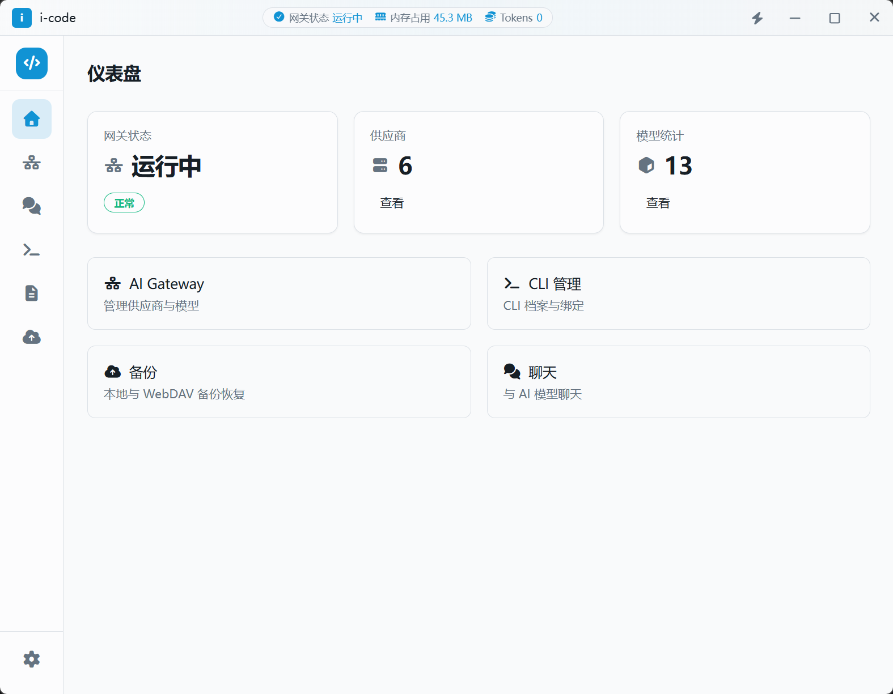
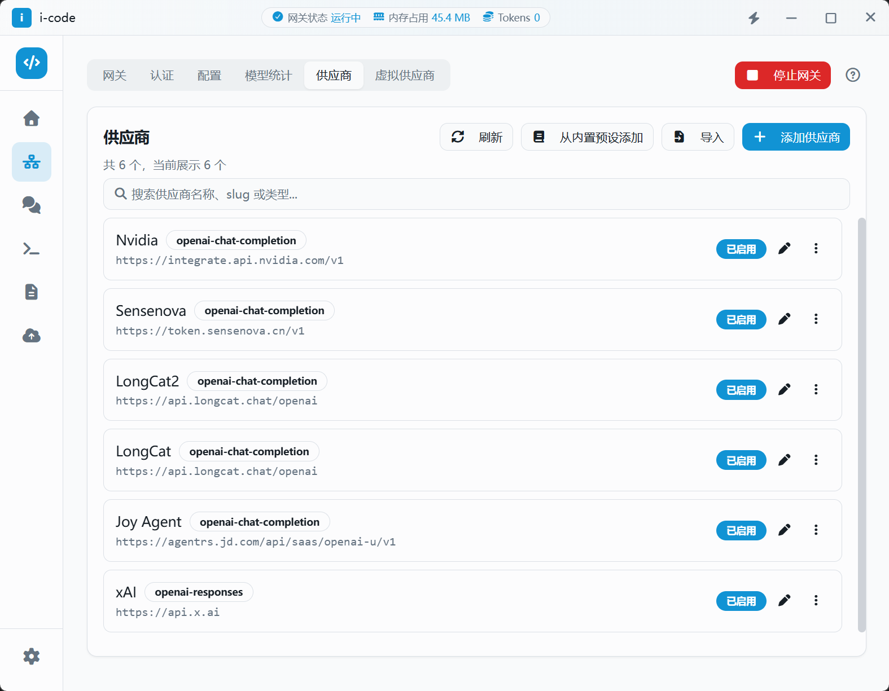
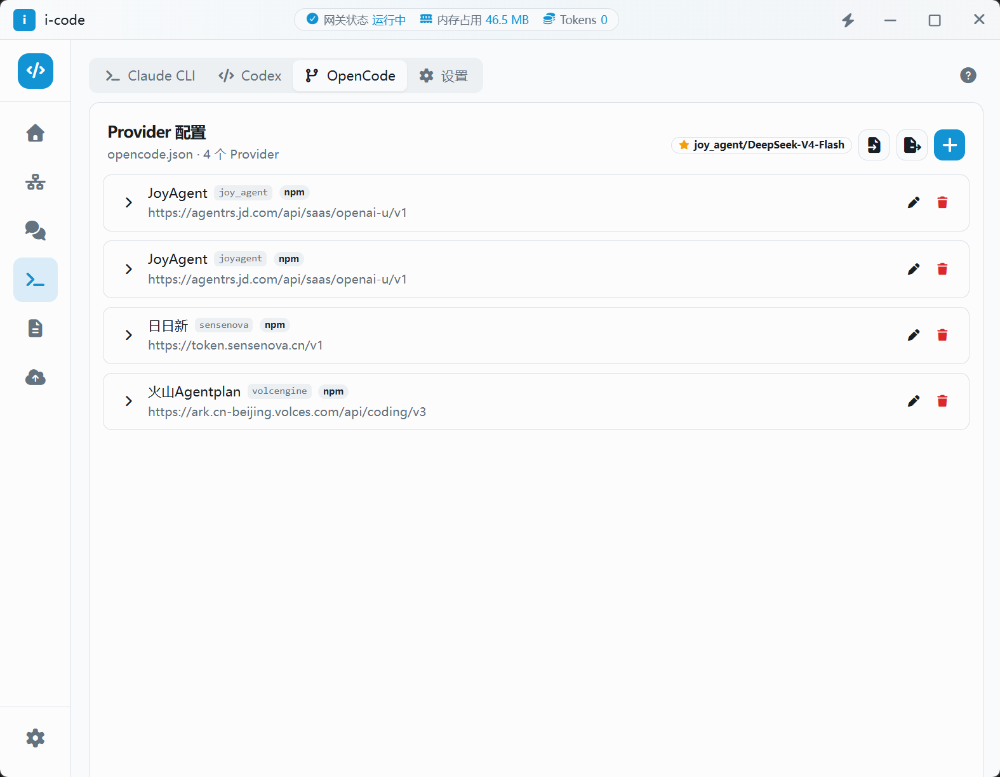
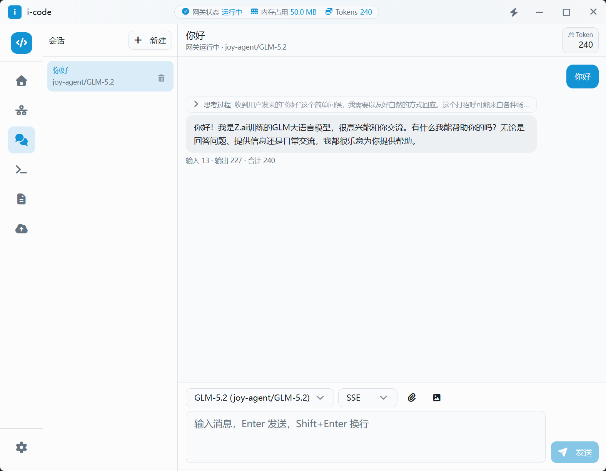

# i-code

<p align="center">
  
</p>

<p align="center">
  <strong>本地 AI 网关与 CLI 配置管理中心</strong>
</p>

<p align="center">
  <a href="https://github.com/xucux/i-code/releases">
    
  </a>
  
  
  
  
  <a href="./README.md">
    
  </a>
</p>

<p align="center">
  <a href="#功能特性">功能特性</a> •
  <a href="#应用截图">应用截图</a> •
  <a href="#技术栈">技术栈</a> •
  <a href="#快速开始">快速开始</a> •
  <a href="#开发指南">开发指南</a> •
  <a href="#架构设计">架构设计</a> •
  <a href="#安全说明">安全说明</a>
</p>

---

## 功能特性

- **AI 网关管理**：集中管理多 LLM 供应商（OpenAI、Anthropic、Gemini、OpenRouter 等），支持多协议与多种认证方式。
- **本地 API 网关**：在 `127.0.0.1:54321` 暴露统一本地接口，通过 `{provider_slug}/{model_id}` 路由到真实供应商。
- **CLI 配置档案**：为 Claude Code、Codex、Gemini CLI 等维护配置档案，可直连供应商或路由到本地网关。
- **聊天界面**：内置聊天 UI，支持发送消息、流式响应、错误气泡展示，消息以 JSONL 格式存储。
- **敏感数据加密**：API Key 等敏感数据通过 AES-GCM 加密存储，配置文件中仅存 `$SECRET:{uuid}$` 引用。
- **额度与调用监控**：支持供应商额度查询与模型调用记录统计。
- **备份与恢复**：支持本地备份与 WebDAV 备份，使用 SQLite Online Backup API。
- **应用内诊断日志**：双日志机制，分别服务开发调试与业务运行时诊断。

## 应用截图


### 仪表盘

<p align="center">
  
</p>

### AI 网关供应商

<p align="center">
  
</p>

### CLI 档案

<p align="center">
  
</p>

### 聊天界面

<p align="center">
  
</p>

## 技术栈

| 层级 | 技术 |
|------|------|
| 桌面框架 | Tauri 2.x（Rust + WebView） |
| 前端 | React 19 + TypeScript 5 |
| 路由 | TanStack Router |
| UI | shadcn/ui + Tailwind CSS + Font Awesome |
| 状态 | Zustand（前端）+ Tauri State（后端） |
| 表单 | react-hook-form + zod |
| 国际化 | i18next（zh-CN / en） |
| 后端 HTTP 网关 | axum |
| 数据库 | SQLite（rusqlite + r2d2） |
| 加密 | AES-GCM |
| 类型同步 | ts-rs（Rust → TypeScript） |

## 快速开始

### 环境要求

- [Node.js](https://nodejs.org/)（推荐 LTS）
- [pnpm](https://pnpm.io/) 11.x
- [Rust](https://www.rust-lang.org/tools/install) 工具链

### 安装

```bash
# 克隆仓库
git clone https://github.com/xucux/i-code.git
cd i-code

# 安装依赖
pnpm install
```

### 运行

```bash
# 桌面端开发模式（推荐）
pnpm tauri:dev

# 仅前端开发
pnpm dev
```

## 开发指南

### 常用命令

```bash
pnpm dev              # 仅前端 Vite 开发服务器
pnpm tauri:dev        # 桌面端开发
pnpm tauri:build      # 桌面端打包
pnpm type-check       # TypeScript 类型检查
pnpm lint             # ESLint
pnpm test             # Vitest 前端测试
pnpm test:rust        # Rust 单元测试
pnpm check            # TypeScript + Rust 检查
pnpm check:all        # 完整检查 + 测试
```

### 项目结构

```
i-code/
├── docs/                 # 设计文档与提案
├── scripts/              # 工具脚本
├── src/                  # 前端 React 应用
│   ├── components/       # UI 组件
│   ├── core/             # 类型、错误、事件、工具函数
│   ├── hooks/            # 共享 hooks
│   ├── modules/          # 业务模块
│   └── routes/           # TanStack 文件路由
├── src-tauri/            # Rust 后端
│   ├── data/             # 内置供应商/模型 JSON
│   ├── src/              # Rust 源码
│   └── tauri.conf.json
└── README.md
```

## 架构设计

```
CLI / 外部客户端
    ↓
本地网关 (axum) @ 127.0.0.1:54321
    ↓
解析 model = {provider_slug}/{model_id}
    ↓
虚拟供应商故障转移路由（如启用）
    ↓
解析 $SECRET:{uuid}$ 引用
    ↓
转发至真实上游供应商
    ↓
拦截器异步写入 logger + call-records
```

## 安全说明

- API Key / Token **禁止以明文形式存储或写入日志**。
- 配置文件与数据库中仅保存加密引用：`$SECRET:{uuid}$`。
- 加解密操作**仅在 Rust 后端**完成。
- 前端仅在输入时接触明文，一次性传往后端，不缓存。
- 内部 CLI 请求必须携带 `inner-cli-api` 请求头；否则需提供有效的 `Authorization: Bearer {gateway_key}`。

## 路线图

- [x] 供应商 / 模型 CRUD 与设置
- [x] 敏感数据本地加密
- [x] 网关运行时（health / models / chat / messages）
- [x] 虚拟供应商路由
- [x] 备份与恢复
- [x] 完整的 CLI 管理业务流程
- [x] 应用内聊天模块
- [x] 系统密钥链 Secret 存储

## 致谢

- [i-code-script-templates](https://github.com/xucux/i-code-script-templates) — 可复用 Rhai 脚本模板公共仓库，用于额度监控等场景。
- 感谢 [vscode-unify-chat-provider](https://github.com/smallmain/vscode-unify-chat-provider) 在供应商/模型统一方面提供的宝贵参考数据与设计灵感。

## 开源协议

[MIT](./LICENSE) © i-code

---

<p align="center">
  使用 <a href="https://tauri.app">Tauri</a>、<a href="https://react.dev">React</a> 与 <a href="https://www.rust-lang.org">Rust</a> 构建。
</p>
