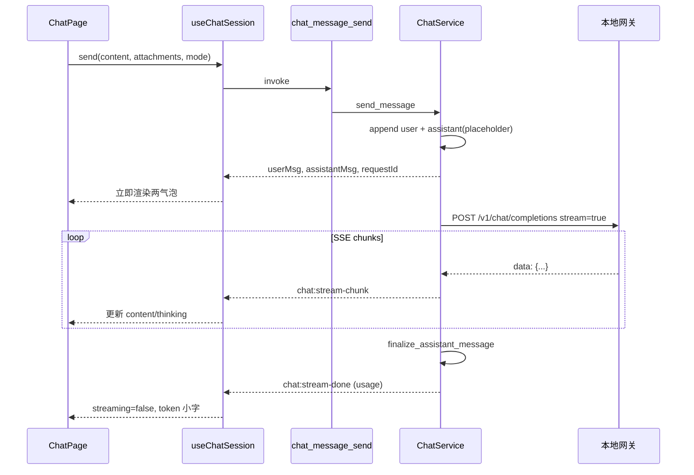

# 聊天模块设计文档

> 模块路径：  
> - 后端 `src-tauri/src/modules/chat/`（`types` / `repository` / `service` / `commands`）  
> - 前端 `src/modules/chat/`（`types.ts` + `ui/*`）、`src/hooks/use-chat.ts`、`src/routes/chat/index.tsx`  
> - 侧栏入口：网关下方 **聊天** → 路由 `/chat`  
>
> 关联文档：[`events.md`](./events.md)、[`gateway-runtime.md`](./gateway-runtime.md)、[`error-handling.md`](./error-handling.md)  
> 最后更新：2026-07-24

---

## 1. 模块定位

应用内对话调试界面：在**本地网关已启动**的前提下，选择已暴露模型，发起 OpenAI 兼容的 `POST /v1/chat/completions`，用于验证供应商、路由 ID、流式与附件行为。

| 能力 | 说明 |
|------|------|
| 多会话 | 新建 / 选中 / 删除；JSONL 持久化 |
| 附件 | 文件全文并入 content；图片 base64 → `image_url`；名称写入会话 |
| 传输 | SSE（默认）/ HTTP |
| 中断 | `requestId` + oneshot 取消 |
| 思考过程 | `thinking` 字段；流式展开、完成后折叠 |
| Token | 气泡单条 usage + 顶栏会话累计 |
| 调用错误 | 助手气泡内展示 **错误码** + **响应 body**（落库可回看） |

**不进 SQLite**：数据落在程序目录 `chat/`。

---

## 2. 界面结构

### 2.1 布局（适配主窗 900×700，紧凑）

```text
┌────────────┬──────────────────────────────────────────┐
│ 会话列表    │ 顶栏：标题 · 网关状态 · 模型 · 累计 Token  │
│ SessionList│──────────────────────────────────────────│
│ · 新建     │ 消息区 MessageList                         │
│ · 选中     │  · 用户气泡（右，primary）                 │
│ · 删除     │  · 助手气泡（左，muted）                   │
│            │  · 思考折叠块 / 错误气泡 / token 小字      │
│            │──────────────────────────────────────────│
│            │ 输入区 ChatInput                           │
│            │  · 附件预览（文件名 / 缩略图）             │
│            │  · 模型 · SSE|HTTP · 发送/中断            │
└────────────┴──────────────────────────────────────────┘
```

### 2.2 组件职责

| 区域 | 文件 | 职责 |
|------|------|------|
| 页面编排 | `ui/chat-page.tsx` | `activeId`、草稿会话、发送/中断、Token 汇总、删除确认 |
| 左侧列表 | `ui/session-list.tsx` | 展示会话；回调新建/选中/删除（无业务副作用） |
| 消息区 | `ui/message-list.tsx` | 气泡、`ThinkingBlock`、`ErrorBubble`、单条 usage |
| 输入区 | `ui/chat-input.tsx` | 文本、附件预览、模型、传输模式、发送/中断按钮 |
| 路由 | `routes/chat/index.tsx` | 挂载 `ChatPage`；会话状态不经 URL |
| Hook | `hooks/use-chat.ts` | Command 封装、列表/会话状态、流式事件合并 |

### 2.3 UI 约束

- 高度：`useAvailableHeight` 实测后传入列表与右侧列，**禁止**仅靠 `h-full`/`flex-1` 猜高度。
- 颜色：CSS 变量（`primary` / `muted` / `destructive` 等），禁止硬编码色值。
- 图标：Font Awesome（`fa-solid`）。
- 文案：i18n 命名空间 `chat`（`zh-CN` / `en`）。

### 2.4 气泡渲染规则

| 消息 | 对齐 | 样式 | 附加块 |
|------|------|------|--------|
| user | 右 | `bg-primary` | 附件缩略图/文件名 |
| assistant 正常 | 左 | `bg-muted` | 上方思考块；下方 token 小字 |
| assistant 失败 | 左 | `ErrorBubble`：`border-destructive` + body `<pre>` | 错误码徽章 |
| system | 左 | `bg-accent` | — |
| 流式中 | — | 正文末尾脉冲 `▍` | 思考块默认展开 |

错误判定（`hasError`）：存在 `error` / `errorCode` / `errorBody`，或 content 已含「错误码:」/「响应 Body:」结构化文本，且非 streaming。

---

## 3. 数据与存储

### 3.1 目录

```text
{程序运行目录}/chat/
  sessions.jsonl                 # 每行一个 ChatSessionSummary
  messages/{session_id}.jsonl    # 每行一个 ChatMessage
```

| 操作 | 行为 |
|------|------|
| 会话 upsert | 读全量索引 → 替换/追加 → **整文件重写** |
| 消息 append | 行追加（发送时用户 + 占位助手） |
| 消息 update | 流式结束/失败时 **重写该会话消息文件** |
| 删除会话 | 去掉索引项 + 删除 `messages/{id}.jsonl` |
| 损坏行 | `log::warn` 后跳过 |

Repository **禁止**调 Service、禁止发事件。

### 3.2 关键类型（camelCase，前后端对齐）

| 类型 | 说明 |
|------|------|
| `ChatSessionSummary` | 列表：id、title、**model**（`{slug}/{model_id}`）、transportMode、messageCount、时间 |
| `ChatSession` | 摘要 + `messages[]` |
| `ChatMessage` | role、content、thinking、attachments、usage、streaming、error、**errorCode**、**errorBody** |
| `PendingAttachment` | 输入区本地预览；发送前映射为 `ChatAttachmentInput` |
| `SendChatMessageResult` | 用户消息 + 占位助手 + 可选 `requestId` |

---

## 4. 前后端交互

### 4.1 Commands

| Command | 说明 |
|---------|------|
| `chat_session_list` | 会话列表（按 updatedAt 倒序） |
| `chat_session_get` | 完整会话（含消息） |
| `chat_session_create` | 创建；默认标题「新会话」 |
| `chat_session_update` | 更新 title / model / transportMode |
| `chat_session_delete` | 删除会话与消息文件 |
| `chat_message_send` | 发送；**同步**返回占位，流式走事件 |
| `chat_message_abort` | 按 `requestId` 中断 |

前端统一 `invokeCommand` / `use-chat.ts`，业务组件禁止直接 `invoke`。

### 4.2 事件（Tauri emit → listen）

| 事件名 | 常量 | 时机 | 主要字段 |
|--------|------|------|----------|
| `chat:stream-chunk` | `CHAT_EVENTS.STREAM_CHUNK` / `BACKEND_EVENTS.CHAT_STREAM_CHUNK` | 增量 | content、thinking、delta、thinkingDelta |
| `chat:stream-done` | `…DONE` | 成功结束 | content、thinking、usage |
| `chat:stream-error` | `…ERROR` | 失败 | error、**errorCode**、**errorBody** |

后端：`service.rs` 中 `EVENT_CHAT_STREAM_*`。  
前端：`useChatSession` 全局 listen，按 `sessionId` 过滤后合并到 `messageId`。

### 4.3 网关请求

```text
ChatService
  → POST {gateway}/v1/chat/completions
  → Header: Content-Type: application/json
            inner-cli-api: <内部密钥>
            Authorization: Bearer <可选，解析 Secret 后>
  → Body: { "model", "messages", "stream" }
```

| 项 | 规则 |
|----|------|
| 前置条件 | 网关 `is_running`；否则校验/发送失败提示 |
| Base URL | 取 bound host/port；`0.0.0.0` → 客户端用 `127.0.0.1` |
| stream | `transportMode === sse` 为 true |
| 中断 | `active_requests[requestId].abort_tx`；`tokio::select!` 与读写竞态 |

---

## 5. 核心业务逻辑

### 5.1 发送主流程

```text
用户点发送 / Enter
  │
  ├─ 网关未运行？ → toast，中止
  ├─ 无模型 / 无内容且无附件 / 已在 sending？ → 中止
  │
  ├─ 无 activeId
  │     → ensureActiveSession（创建并选中）
  │     → 清空输入，写入 pendingSendRef
  │     → setActiveId → effect 待 hook 对齐后再 send
  │
  └─ 有 activeId
        → 必要时 update model/transportMode
        → 清空输入
        → useChatSession.send → chat_message_send
              │
              ├─ 落库：用户消息 + 占位助手（streaming=true）
              ├─ 首条消息：截断 content/附件名 → 会话 title
              ├─ 注册 requestId + oneshot
              ├─ 同步返回两气泡 + requestId
              └─ spawn run_chat_request
                    ├─ SSE：chunk 事件刷新 content/thinking
                    ├─ HTTP：整包解析后一次 chunk + done
                    ├─ 成功：finalize + stream-done（usage）
                    └─ 失败：finalize 错误字段 + stream-error
```

### 5.2 草稿会话（未点「新建」）

需求：进入聊天页直接打字或加附件 → **自动建会话并选中**。

| 触发 | 行为 |
|------|------|
| 输入非空 | `ensureActiveSession({ silent: true })` |
| 附件从 0→有 | 同上 |
| 发送时仍无会话 | `ensureActiveSession` 后 `pendingSendRef` |

防抖：`ensuringSessionRef` + `ensureSessionPromiseRef` 复用同一 Promise，避免连打字重复 create。

### 5.3 延迟发送（pendingSendRef）

新建/草稿后立即 send 时，`useChatSession(activeId)` 可能尚未完成加载，reload 会冲掉本地 streaming 状态。

解决：先 `setActiveId`，把 content/attachments/mode 放入 `pendingSendRef`；`useEffect` 在 `activeId === pending.sessionId` 时再调 `send`。

### 5.4 附件

| 类型 | 前端读取 | 后端协议 | 会话展示 |
|------|----------|----------|----------|
| file | `readAsText` → `textContent` | 全文并入 user content | `[附件: name]` + 气泡标签 |
| image | data URL + base64 | `image_url` 多模态 part | `[图片: name]` + 缩略图 |

- 输入区：附件在 Textarea **上方**预览（文件名小字 / 小图）。
- 组历史：历史用户若带 attachments 结构，重新 `build_user_openai_message`。

### 5.5 思考过程

- 解析路径：`reasoning_content` / `reasoning` / `thinking`，以及 content 数组中的 thinking 片段。
- 字段：`ChatMessage.thinking`；chunk 带累计 `thinking` 与 `thinkingDelta`。
- UI：`ThinkingBlock`  
  - streaming：默认展开  
  - 结束：默认折叠  
  - 用户手动切换后不再自动改写

### 5.6 Token

| 层级 | 来源 | 展示 |
|------|------|------|
| 单条 | done 事件 / 落库 `usage` | 助手气泡下小字：prompt · completion · total |
| 会话 | 遍历当前 messages 的 usage 求和 | 顶栏「总 Token」；hover 看 prompt/completion 合计 |

`totalTokens` 缺失时用 `prompt + completion`。

### 5.7 中断

1. 发送中输入区显示红色「中断」。
2. `chat_message_abort(requestId)` → 取出 `abort_tx` 发送。
3. `execute_gateway_chat` / SSE 循环 `select` 到取消 → 返回已生成 content + `aborted=true`。
4. 空内容时 content 记为「（已中断）」；仍走 **done** 路径（非 error）。

### 5.8 调用错误（气泡内展示）

**需求**：会话中大模型调用失败时，在助手气泡直接展示 **错误码** 与 **响应 body**。

| 字段 | 含义 |
|------|------|
| `error` | 摘要（兼容） |
| `errorCode` | HTTP 状态（如 `401`）或协议 code（如 `invalid_api_key`） |
| `errorBody` | 上游/网关响应 body **原文，不截断** |
| `content` | 同时写入 `错误码: …\n响应 Body:\n…` 便于纯文本回看 |

**后端链路：**

1. 非 2xx：读完整 body → `extract_error_message` / `extract_error_code`。
2. `IcodeError::gateway(...).with_details({ httpStatus, errorCode, errorBody, summary })`。
3. `parse_chat_call_error` → `format_error_bubble_content` → `finalize_assistant_message`。
4. `emit chat:stream-error`（error / errorCode / errorBody）。

**前端链路：**

1. `useChatSession` 监听 error：合并字段；content 可用 `formatChatErrorBubbleContent` 兜底。
2. `MessageList` → `ErrorBubble`：标题 + 错误码徽章 + body（`<pre>` 可滚动）。
3. 重开会话：JSONL 读出 error 字段，仍渲染错误气泡。

**组历史请求：** 助手消息仅有 error 且 content 为空时跳过；已写入错误 content 的失败回复一般不作为有效 assistant 续聊（实现以 `build_openai_messages` 过滤为准）。

### 5.9 会话切换与 reload 保护

- 切换 `activeId`：加载 `chat_session_get`；清空输入区草稿。
- 若本地 messages 同会话且存在 `streaming=true`，**不**用磁盘结果覆盖，避免冲掉在途气泡。
- 删除当前会话：`activeId = null`。

---

## 6. 前端状态一览

| 状态 | 位置 | 说明 |
|------|------|------|
| `sessions` | `useChatSessions` | 左侧列表 |
| `activeId` | `ChatPage` | 当前会话；null 可草稿创建 |
| `input` / `attachments` | `ChatPage` | 未发送草稿 |
| `selectedModel` / `transportMode` | `ChatPage` | 有效值优先会话，否则本地/列表首项 |
| `pendingSendRef` | `ChatPage` | 新建后延迟发送快照 |
| `ensuringSessionRef` | `ChatPage` | 防止重复 create |
| `messages` / `sending` / `activeRequestId` | `useChatSession` | 消息与流式/中断 |
| 模型选项 | `useExposedModels` + `buildModelId` | 仅已暴露模型 |

---

## 7. 后端分层

```text
commands.rs     参数接收 → Service → IcodeResult
service.rs      会话 CRUD、组包、HTTP/SSE、中断、emit
repository.rs   仅 JSONL I/O
types.rs        DTO（serde camelCase）
```

依赖：`GatewayRuntimeHandle`（地址与 inner-cli-api）、`AiGatewayServiceHandle`（默认 key 配置）、`SecretServiceHandle`（解析 key）、`AppHandle`（emit）。

日志：开发追踪用 **`log::`**（tauri-plugin-log）；**禁止**把 Secret 明文写入日志。错误 body 仅存本地 JSONL 会话文件。

---

## 8. 时序图（发送 + SSE）



失败时最后一步改为 `chat:stream-error`，UI 渲染 `ErrorBubble`。

---

## 9. 相关文件索引

| 路径 | 说明 |
|------|------|
| `src/modules/chat/ui/chat-page.tsx` | 页面编排、草稿与发送 |
| `src/modules/chat/ui/session-list.tsx` | 左侧会话 |
| `src/modules/chat/ui/message-list.tsx` | 气泡 / 思考 / 错误 |
| `src/modules/chat/ui/chat-input.tsx` | 输入与附件 |
| `src/modules/chat/types.ts` | 前端 DTO |
| `src/hooks/use-chat.ts` | Command + 流式 hook |
| `src/core/events.ts` | `BACKEND_EVENTS.CHAT_STREAM_*` |
| `src-tauri/src/modules/chat/mod.rs` | 模块说明 |
| `src-tauri/src/modules/chat/service.rs` | 业务与网关调用 |
| `src-tauri/src/modules/chat/repository.rs` | JSONL |
| `src-tauri/src/modules/chat/commands.rs` | Tauri Command |
| `src-tauri/src/modules/chat/types.rs` | 后端 DTO |

---

## 10. 实现清单对照

| 能力 | 状态 |
|------|------|
| 会话 CRUD + 侧栏「聊天」入口 | ✅ |
| 左右布局 / 主题气泡 | ✅ |
| 附件全文 + 图片 base64 + 名称入会话 | ✅ |
| JSONL 程序目录 | ✅ |
| SSE / HTTP + 气泡 token | ✅ |
| 输入区中断 | ✅ |
| 思考过程折叠 | ✅ |
| 未新建直接输入 → 草稿会话 | ✅ |
| 顶栏会话总 Token | ✅ |
| 气泡展示错误码 + body | ✅ |

---

## 11. 维护约定

1. 改界面布局或发送/草稿/错误展示逻辑时，**同步更新本文**。
2. 增删 Command / 流式事件字段时，同步本文 §4 与 [`events.md`](./events.md)。
3. 改 DTO 时同时改 `types.rs` 与 `types.ts`，并 `cargo check` / `pnpm type-check`。
4. 文档与代码冲突时 **以代码为准**，并回写本文。

---

*本文描述聊天界面与模块逻辑边界；网关转发细节见 [`gateway-runtime.md`](./gateway-runtime.md)。*
