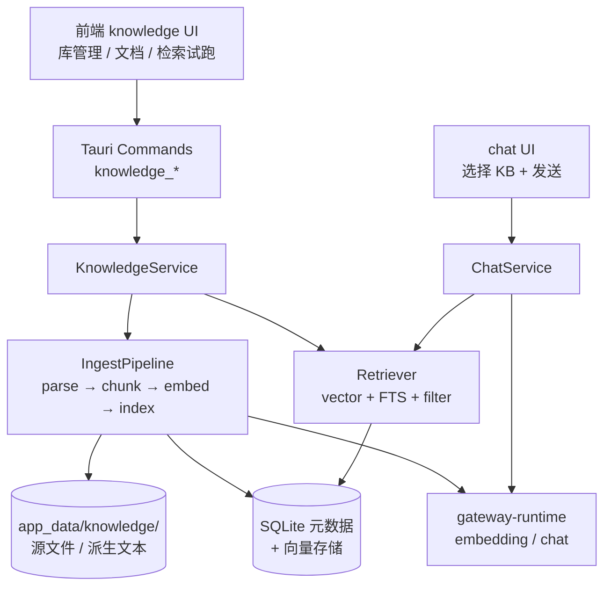

# RAG 知识库集成设计方案

> 状态：设计草案（未实现）  
> 版本：v0.1.0  
> 日期：2026-07-24  
> 关联：`AGENTS.md`、`docs/development.md`、`docs/database.md`、`docs/chat-module.md`、`docs/gateway-runtime.md`  
> 目标模块：前后端 `knowledge`（新建）

---

## 1. 结论摘要

RAG 应作为**独立业务域**引入，而不是塞进 `chat` 或 `workspace` 内部：

| 建议 | 说明 |
|------|------|
| 新模块名 | `knowledge`（前后端同名） |
| 边界 | 只负责「文档 → 索引 → 检索 → 引用片段」 |
| 消费方 | `chat`、可选 `gateway-runtime`、可选 MCP / Workspace 应用层 |
| 不负责 | LLM 对话本身、供应商认证、CLI 配置写入 |

依赖方向：

```text
core / secret / db / logger / tokenizer
        ↑
   ai-gateway / gateway-runtime
        ↑
     knowledge          ← 新模块
        ↑
  chat / workspace / (mcp 导出)
```

`knowledge` 可以调用网关做 embedding / rerank，但**不能**被 `ai-gateway` 反向依赖。

---

## 2. 产品定位

结合 i-code 现有能力，知识库最自然的三层用途：

| 层级 | 场景 | 价值 |
|------|------|------|
| **应用内 Chat** | `/chat` 勾选知识库后问答 | 调试供应商时同时验证 RAG |
| **Workspace 上下文** | 工作区绑定知识库，应用/导出给 CLI | 与 Prompts / MCP / Skill 并列的第四类上下文 |
| **网关侧可选增强** | 特定模型或 header 触发检索注入 | CLI / 外部客户端也能用同一套 KB |

**v1 建议只做前两层**；网关拦截注入放到 v2，避免一开始把协议面做大。

---

## 3. 总体架构



### 3.1 模块落位

```text
src/modules/knowledge/
  types.ts
  ui/                    # 库列表、文档管理、检索试跑、绑定选择器

src/hooks/
  use-knowledge.ts
  use-knowledge-mutation.ts

src-tauri/src/modules/knowledge/
  types.rs
  commands.rs
  service.rs             # 编排：导入、索引、检索、删除
  repository.rs          # 元数据 SQL
  ingest/
    parser.rs            # md/txt/pdf/code 等
    chunker.rs
    embedder.rs          # 调网关 embedding
  store/
    vector_store.rs      # 向量读写抽象
    fts.rs               # SQLite FTS5 可选
  retriever.rs
  context_builder.rs     # 把 hit 拼成 system/user 上下文
```

路由建议：

| 路径 | 用途 |
|------|------|
| `/knowledge` | 知识库总览 |
| `/knowledge/$kbId` | 文档、索引状态、试检索 |
| Chat 输入区 | 会话级绑定 KB（多选） |
| Workspace 详情 | 工作区默认 KB 绑定 |

---

## 4. 数据模型

元数据进 **SQLite**；大文件与向量索引放 **程序数据目录**（与 chat 的 JSONL 策略类似，避免把 blob 全塞主库）。

### 4.1 表设计草案

```sql
-- 知识库
CREATE TABLE knowledge_bases (
  id TEXT PRIMARY KEY,
  slug TEXT NOT NULL UNIQUE,
  display_name TEXT NOT NULL,
  description TEXT,
  embedding_model TEXT NOT NULL,   -- 如 provider_slug/model_id
  chunk_size INTEGER NOT NULL,
  chunk_overlap INTEGER NOT NULL,
  status TEXT NOT NULL,             -- ready | indexing | error
  workspace_id TEXT,               -- 可选：工作区私有库；NULL=全局
  created_at TEXT NOT NULL,
  updated_at TEXT NOT NULL
);

-- 文档
CREATE TABLE knowledge_documents (
  id TEXT PRIMARY KEY,
  knowledge_base_id TEXT NOT NULL,
  title TEXT NOT NULL,
  source_type TEXT NOT NULL,         -- file | url | paste | folder
  source_path TEXT,
  content_hash TEXT,
  mime_type TEXT,
  byte_size INTEGER,
  status TEXT NOT NULL,             -- pending | parsing | indexing | ready | failed
  error_message TEXT,
  chunk_count INTEGER,
  indexed_at TEXT,
  created_at TEXT NOT NULL,
  updated_at TEXT NOT NULL,
  FOREIGN KEY (knowledge_base_id) REFERENCES knowledge_bases(id) ON DELETE CASCADE
);

-- 分块（可只存元数据，正文可放旁路文件）
CREATE TABLE knowledge_chunks (
  id TEXT PRIMARY KEY,
  document_id TEXT NOT NULL,
  knowledge_base_id TEXT NOT NULL,
  chunk_index INTEGER NOT NULL,
  content TEXT,                    -- 或仅 content_path
  token_count INTEGER,
  metadata_json TEXT,              -- heading path、行号、语言等
  created_at TEXT NOT NULL,
  FOREIGN KEY (document_id) REFERENCES knowledge_documents(id) ON DELETE CASCADE,
  FOREIGN KEY (knowledge_base_id) REFERENCES knowledge_bases(id) ON DELETE CASCADE
);

-- 绑定关系（会话 / 工作区 / CLI）
CREATE TABLE knowledge_bindings (
  id TEXT PRIMARY KEY,
  target_type TEXT NOT NULL,       -- chat_session | workspace | cli_profile
  target_id TEXT NOT NULL,
  knowledge_base_id TEXT NOT NULL,
  enabled INTEGER NOT NULL DEFAULT 1,
  top_k INTEGER,
  score_threshold REAL,
  created_at TEXT NOT NULL,
  updated_at TEXT NOT NULL,
  UNIQUE(target_type, target_id, knowledge_base_id),
  FOREIGN KEY (knowledge_base_id) REFERENCES knowledge_bases(id) ON DELETE CASCADE
);

-- 检索审计（可选，便于调试）
CREATE TABLE knowledge_query_logs (
  id TEXT PRIMARY KEY,
  knowledge_base_id TEXT,
  query TEXT NOT NULL,
  hit_chunk_ids_json TEXT,
  latency_ms INTEGER,
  created_at TEXT NOT NULL
);
```

### 4.2 文件布局

```text
{app_data}/knowledge/
  {kb_id}/
    sources/                 # 用户导入的原文件副本（可选）
    derived/{doc_id}.txt     # 解析后纯文本
    vectors/                 # LanceDB / sqlite-vec 等索引目录
```

原则：

- 配置与关系 → SQLite
- 大文本与向量 → 旁路存储
- Secret 仍只走 `secret` 模块；embedding 调网关时复用现有 `$SECRET:` 解析

---

## 5. 核心流水线

### 5.1 入库 / 索引

```text
选择文件/文件夹/粘贴
  → knowledge_document_import
  → 复制到 sources/（可选）+ 算 content_hash
  → 若 hash 未变则跳过
  → Parser：md/txt/code 优先；pdf/docx 二期
  → Chunker：按 token（复用 tokenizer）+ heading 边界
  → Embedder：POST 本地网关 /v1/embeddings（或供应商原生）
  → VectorStore.upsert(chunk_id, embedding, payload)
  → 更新 document/chunk 状态
  → emit knowledge:index-progress / knowledge:index-done
```

### 5.2 检索

```text
query
  → 可选 query rewrite（小模型，默认关）
  → embed(query)
  → vector topK
  → 可选 FTS5 关键词召回并 RRF 融合
  → 可选 rerank（二期）
  → 按 token budget 截断
  → 返回 Citation[]
```

### 5.3 注入 Chat（与现有 chat 对齐）

现有链路：

```text
ChatService → POST 本地网关 /v1/chat/completions
```

建议改成**可选前置检索**，不改网关协议主体：

```text
chat_message_send
  → 读 session 绑定的 knowledge_bases
  → KnowledgeService.retrieve(query=user_text, top_k, filters)
  → ContextBuilder 生成 system/context 块 + citations
  → 把引用块并入 messages（system 或独立 context message）
  → 原样走网关 chat completions
  → 助手消息附加 citations 字段，UI 展示来源
```

`ChatMessage` 扩展建议：

```ts
citations?: Array<{
  knowledgeBaseId: string
  documentId: string
  documentTitle: string
  chunkId: string
  excerpt: string
  score: number
  sourcePath?: string
}>
```

流式事件可先不带 citation；在 `stream-done` 或发送前同步返回即可。

---

## 6. 需要补齐的架构支持

### 6.1 必须（MVP）

| 能力 | 说明 | 落点 |
|------|------|------|
| **独立 `knowledge` 模块** | 标准 commands / service / repository | 前后端 modules |
| **后台任务 / 进度事件** | 索引是长任务，不能堵 UI Command | Tauri Event：`knowledge:index-*` |
| **Embedding 调用通道** | 优先走本地网关，统一鉴权与模型 ID | `gateway-runtime` 补 `/v1/embeddings`（若尚未完整） |
| **向量存储抽象** | `VectorStore` trait，可换实现 | Rust trait + 一种默认实现 |
| **分块 + tokenizer 预算** | 已有 `tokenizer` 模块，按模型计 token | `knowledge` 依赖 `tokenizer` |
| **Chat 绑定与注入点** | 会话级 KB 选择 + send 前 retrieve | `chat` service 编排 |
| **磁盘数据目录约定** | 与 `chat/` 并列 | app data path helper |
| **DB migration** | 新表只追加 | `V{nnn}__knowledge.sql` |

### 6.2 强烈建议（v1.1）

| 能力 | 说明 |
|------|------|
| **SQLite FTS5 混合检索** | 代码 / 专有名词向量常漏，FTS 兜底 |
| **增量索引** | `content_hash` + mtime，文件夹 watch 可后置 |
| **引用 UI** | 气泡下来源卡片，点击打开本地文件 |
| **Workspace 绑定** | `knowledge_bindings(target_type=workspace)` |
| **删除级联** | 删库 / 删文档时同步删向量与旁路文件 |
| **备份策略** | `backup` 是否包含 knowledge 旁路目录要显式约定 |

### 6.3 可选增强（v2）

| 能力 | 说明 |
|------|------|
| **网关 Middleware 检索** | 请求头 `X-ICode-Knowledge: kb_slug` 自动注入 |
| **MCP 工具导出** | `search_knowledge` / `get_chunk`，CLI 直接用 |
| **Rerank / HyDE** | 质量提升 |
| **多模态文档** | 图片 OCR、表格结构 |
| **本地 embedding 引擎** | 不经网关的 GGUF/ONNX，离线优先场景 |

### 6.4 现有模块如何托住 RAG

| 现有模块 | 对 RAG 的作用 |
|----------|----------------|
| `gateway-runtime` | embedding + chat 统一出口 |
| `ai-gateway` / `virtual-provider` | 选 embedding 模型、故障转移 |
| `tokenizer` | chunk 大小与 context budget |
| `secret` | 上游 Key 仍不落前端 |
| `logger` / `call-records` | 索引 embedding 调用可记日志 / 统计 |
| `chat` | 主消费方 |
| `workspace` | 库作用域与 CLI 上下文 |
| `backup` | 元数据 + 向量目录备份 |
| `settings` | 默认 embedding 模型、top_k、budget |

---

## 7. 技术选型建议（贴合 Tauri 本地桌面）

| 组件 | 推荐 | 原因 |
|------|------|------|
| 向量库 | **LanceDB** 或 **sqlite-vec** | 嵌入式、无独立服务；LanceDB 适合中等规模本地文件 |
| MVP 极简 | SQLite 存 embedding BLOB + 暴力 / 余弦 | 文档量 < 几万 chunk 时可先跑通 |
| Embedding | 经本地网关的 embedding 模型 | 与现有供应商体系一致 |
| 解析 | 先 `md/txt/json/code`，再 pdf | 降低 Rust 依赖复杂度 |
| 分块 | 递归字符 + heading 感知；token 上限用 tokenizer | 与模型上下文对齐 |
| 检索 | 向量 topK + FTS 融合 | 中文 / 代码更稳 |

**不建议 v1：**

- 引入独立 Qdrant / Milvus 进程（运维重，违背本地桌面简单性）
- 前端做 embedding / 存明文 Key
- 把全部 chunk 正文硬塞进主 `i-code.db` 无上限

---

## 8. 与 Chat / Workspace / Gateway 的集成边界

### 8.1 Chat（优先）

- 会话绑定 0..N 个知识库
- 发送前检索，注入只读 context
- 引用可回看
- **不**把检索逻辑写进前端；前端只传 `knowledgeBaseIds` 或使用 session 绑定

### 8.2 Workspace

- Workspace 可绑定默认 KB
- `workspace_apply` **不要**把整库拷进 CLI 配置
- 更合理：
  - 应用时只写「KB 引用 + 检索策略」；或
  - 导出为 MCP server 配置，让 CLI 通过 MCP 调本地检索

后者更符合现有「工作区隔离 MCP」模型。

### 8.3 Gateway（后置）

```text
POST /v1/chat/completions
Header: X-ICode-RAG: on
Header: X-ICode-KB: my-docs
```

由 `upstream` 前置 retrieve 再转发。

注意：会改变客户端可见 prompt，需开关默认关闭，并写清日志（自研 logger + 开发 log 两套都可记「命中了哪些 chunk」，禁止记 secret）。

---

## 9. Command / 事件草案

### 9.1 Commands

| Command | 职责 |
|---------|------|
| `knowledge_base_list` | 库列表 |
| `knowledge_base_create` | 创建库 |
| `knowledge_base_update` | 更新库 |
| `knowledge_base_delete` | 删除库（级联文档 / 向量 / 旁路文件） |
| `knowledge_document_import` | 导入文件 / 目录 / 粘贴 |
| `knowledge_document_list` | 文档列表 |
| `knowledge_document_delete` | 删除文档 |
| `knowledge_document_reindex` | 重新索引 |
| `knowledge_search` | 试检索 / Chat 共用 |
| `knowledge_binding_set` | 设置会话或工作区绑定 |
| `knowledge_binding_list` | 绑定列表 |
| `knowledge_index_status` | 进度查询 |

前端统一通过 `invokeCommand` / `use-knowledge*.ts` 调用，业务组件禁止直接 `invoke`。

### 9.2 Events

| 事件 | 用途 |
|------|------|
| `knowledge:index-progress` | `{ docId, processed, total, stage }` |
| `knowledge:index-done` | 索引成功 |
| `knowledge:index-error` | 索引失败（无堆栈明文） |

事件名使用 kebab-case，常量维护在 `src/core/events.ts` 与后端对应模块。

---

## 10. Context 组装规范

推荐固定模板（系统侧策略，不必直接展示给用户原文）：

```text
[Retrieved Knowledge]
Use the following excerpts if relevant. Cite as [n].

[1] title=xxx path=... score=0.82
excerpt...

[2] ...
[/Retrieved Knowledge]
```

规则：

1. **token budget**：例如模型 context 的 15%–25%，从 `tokenizer` 估算
2. **去重**：同文档相邻 chunk 合并
3. **失败降级**：检索失败不阻断聊天，只 toast / 记日志
4. **隐私**：导入路径与原文默认不出网；仅 embedding / chat 走用户配置的供应商

---

## 11. 分阶段实施路线

### Phase 0 — 架构预留

- 定模块名、表草案、目录、事件名
- 确认 embedding 是否走网关，以及默认模型配置入口

### Phase 1 — MVP（核心）

- KB / Document CRUD
- md / txt 解析 + chunk + 一种向量存储
- `knowledge_search`
- Chat 会话绑定 + 发送前注入 + citation UI
- 索引进度事件

### Phase 2 — 可用化

- 文件夹导入、hash 增量
- FTS 混合检索
- Workspace 绑定
- backup 纳入 knowledge 目录
- 检索试跑页

### Phase 3 — 生态

- MCP `search_knowledge`
- 网关 header 注入
- PDF / 更多格式、rerank

---

## 12. 风险与硬约束（对齐 AGENTS.md）

| 风险 | 处理 |
|------|------|
| 主窗口 900×700 | KB 页用紧凑列表 + 详情抽屉；检索结果用 `useAvailableHeight` |
| 长任务卡 UI | 索引一律 `spawn` 后台 + Event，Command 只返回 jobId / accepted |
| Secret 泄露 | embedding 请求体可含用户文档，日志必须截断 / 脱敏 |
| 模块越界 | `chat` 只调 `KnowledgeService.retrieve`，不直接碰向量库 |
| 备份不完整 | 恢复 DB 后向量目录缺失 → 状态标 `needs_reindex` |
| 网关未启动 | 索引 / embedding 明确报错；Chat 检索失败可降级为无 RAG |
| 用户可见文案 | 全部走 i18n（`zh-CN` / `en`），键名 `knowledge.*` |
| 颜色 / 图标 | CSS 变量 + Font Awesome，禁止硬编码色值与 lucide |

---

## 13. 分层与编码约束

与现有模块一致：

**前端：**

- 仅 `types.ts` + `ui/`（+ 必要时 hooks 放 `src/hooks/`）
- **无** Repository / Service 层
- 数据访问一律 `invokeCommand`

**后端：**

```text
commands.rs  → 参数校验、调 Service、错误转换
service.rs   → 业务逻辑与编排
repository.rs → 仅 SQL / 数据访问
types.rs     → DTO / 领域类型
```

- Service **禁止**直接访问其他模块 Repository
- 跨模块只读数据：通过对方 Service 接口
- 错误统一 `IcodeError`；DTO `#[serde(rename_all = "camelCase")]`
- 迁移只追加：`src-tauri/src/db/migrations/V{nnn}__knowledge.sql`

---

## 14. 最小闭环（建议开工顺序）

1. 新模块 `knowledge`（后端四层 + 前端 types/ui）
2. SQLite 元数据 + LanceDB / sqlite-vec 之一
3. 仅支持本地 `md/txt`
4. Embedding 统一 `{provider_slug}/{model_id}` 经本地网关
5. Chat 发送链路插入 retrieve + citations
6. 实现文档：可在本 plan 定稿后拆分为 `docs/knowledge-module.md`

---

## 15. 待决事项

| 项 | 选项 | 建议 |
|----|------|------|
| 向量存储默认实现 | LanceDB / sqlite-vec / BLOB 暴力检索 | MVP 可先 sqlite-vec 或 BLOB；规模上来再 LanceDB |
| Embedding 入口 | 仅网关 `/v1/embeddings` / 直连供应商 | 仅网关，保持 Secret 与路由一致 |
| Chat 绑定粒度 | 仅会话 / 会话 + 全局默认 | 会话优先，settings 可设默认 KB |
| Workspace 导出形态 | 仅绑定元数据 / MCP 工具 | v1 绑定元数据；v2 MCP |
| 是否纳入 backup 默认集 | 是 / 否 / 可选 | 默认包含元数据；向量目录可选勾选 |

---

*维护说明：实现启动后，将状态改为「进行中 / 已落地」，并同步 `docs/development.md` 模块清单、`docs/database.md` 表结构、`docs/events.md` 事件表。细节实现文档建议另建 `docs/knowledge-module.md`，本文件保留为 plan 级总览。*
