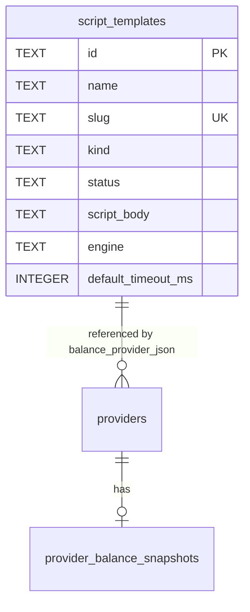

# 额度监控脚本模板（Rhai）开发文档

> 状态：已实现（MVP）  
> 关联：  
> - `docs/database.md` §4.3 / §5.10、`provider_balance_snapshots`  
> - `src-tauri/src/modules/balance/`  
> - `src/modules/balance/`、`src/modules/ai-gateway/ui/balance-config-form`（`BalanceConfigForm`）  
> - `src/routes/gateways/index.tsx`（网关总览 Tabs）  
> - 引擎选型：Rhai（纯 Rust 脚本引擎）

---

## 1. 背景与目标

### 1.1 现状

当前额度监控仅支持**硬编码** `BalanceMethod`（DeepSeek / OpenRouter / 硅基流动等）：

```text
解密 Secret → BalanceRefreshInput → providers/*.rs → BalanceSnapshot
```

用户无法对接未内置的供应商或私有网关额度接口。

### 1.2 目标

| 编号 | 目标 | 说明 |
|------|------|------|
| G1 | 自定义脚本额度监控 | 用户用 Rhai 写 HTTP 调用 + 解析响应，产出标准 `BalanceSnapshot` |
| G2 | 脚本模板市场 | 网关页「虚拟供应商」右侧新增「脚本模板」Tab，管理可复用模板 |
| G3 | 模板生命周期 | 状态：`draft`（草稿）/ `active`（启用）/ `disabled`（禁用） |
| G4 | 脚本编辑体验 | CodeMirror 高亮、内置 snippet、系统变量 / 系统函数文档、参考示例 |
| G5 | 兼容既有硬编码 | 供应商额度下拉保留全部内置方法；额外分组展示「自定义脚本」列表 |
| G6 | 安全边界 | API Key 仅内存注入；禁文件 IO；HTTP 超时与 host 约束；日志脱敏 |

### 1.3 非目标（本期不做）

- 脚本类型扩展为通用插件（仅 `balance` 一类）
- ~~在线社区/云端模板市场同步~~ → **已拆出独立提案**：[script-template-marketplace.md](./script-template-marketplace.md)（公共 GitHub 仓 + 应用内市场浏览/一键应用；本文件 G2 仅指本地「脚本模板」Tab 管理）
- 脚本调试断点、单步执行
- Python / Lua / JS 多引擎并存

---

## 2. 总体架构

### 2.1 模块边界

```text
core/shared
    ↑
balance（扩展 script 运行时 + 既有硬编码 Provider）
    ↑
script-template（新模块：模板 CRUD / 状态 / 试运行编排）
    ↑
ai-gateway（供应商选择脚本模板、刷新额度时注入上下文）
    ↑
frontend routes/gateways + modules/script-template + modules/balance
```

| 模块 | 路径 | 职责 |
|------|------|------|
| `script-template` | `src/modules/script-template/` ↔ `src-tauri/src/modules/script-template/` | 模板实体 CRUD、状态机、列表筛选、试运行 Command |
| `balance` | 现有模块扩展 | `BalanceMethod::Script`、Rhai 引擎、host functions、`ScriptBalanceProvider` |
| `ai-gateway` | 现有 | `build_balance_refresh_input` 解析 `scriptTemplateId` 并加载启用中的脚本 |

> 分层规则不变：`commands → service → repository`；跨模块只经 Service。

### 2.2 运行时数据流

```text
用户点「刷新额度」
  → ai_gateway.balance_refresh_provider
  → 解析 provider.balance_provider_json
  → 若 method = script:
       1. 校验 script_template_id 存在且 status = active
       2. 解密 auth → api_key 等
       3. 构造 ScriptContext（系统变量）
       4. Rhai Engine + host(http/json/log/error)
       5. 执行 script_body → Dynamic
       6. 校验并映射为 BalanceSnapshot
  → 否则：既有硬编码 dispatch_refresh
  → 写入 provider_balance_snapshots + emit balance:snapshot-updated
```

### 2.3 模板与供应商关系

```text
script_templates (1)  ←被引用─  providers.balance_provider_json
        │                         { "method": "script", "scriptTemplateId": "..." }
        │
        └── 仅 status=active 可被额度刷新使用
            draft / disabled 仅可编辑与试运行（试运行允许 draft）
```

- **一对多**：一个模板可被多个供应商引用。  
- **删除约束**：若仍有供应商引用，禁止物理删除（或要求先解绑）；可改为 `disabled`。  
- **快照不存脚本正文**：`provider_balance_snapshots` 仍只存查询结果。

---

## 3. 领域模型

### 3.1 脚本模板类型

本期仅一种：

```ts
export type ScriptTemplateKind = 'balance'
```

预留扩展（不落库枚举硬编码死）：未来可加 `request-interceptor` 等，表字段用 `TEXT`。

### 3.2 生命周期状态

```ts
export type ScriptTemplateStatus = 'draft' | 'active' | 'disabled'
```

| 状态 | 含义 | 可编辑 | 可被供应商选用 | 可正式刷新额度 | 可试运行 |
|------|------|--------|----------------|----------------|----------|
| `draft` | 草稿，开发中 | ✅ | ❌（下拉不出现） | ❌ | ✅ |
| `active` | 启用 | ✅ | ✅ | ✅ | ✅ |
| `disabled` | 禁用 | ✅ | ❌ | ❌（已绑定供应商刷新报明确错误） | ✅（便于排查） |

**状态迁移：**

```text
        publish          disable
  draft ──────→ active ──────→ disabled
    ↑              │               │
    └──────────────┴───────────────┘
         重新设为草稿（可选，或仅 active↔disabled）
```

建议迁移 API：

| 动作 | 从 | 到 | 规则 |
|------|----|----|------|
| `publish` | draft / disabled | active | 脚本非空；可选做一次 dry-run schema 检查 |
| `disable` | active / draft | disabled | 无额外限制 |
| `revert_to_draft` | active / disabled | draft | 若有供应商绑定，UI 二次确认 |

### 3.3 脚本配置（挂在供应商上）

扩展 `BalanceConfig`：

```ts
// 既有硬编码方法保持不变
| { method: 'deepseek' }
// ...
| {
    method: 'script'
    /** 引用 script_templates.id */
    scriptTemplateId: string
    /**
     * 可选覆盖：单次查询超时（毫秒）
     * 未设置则用模板 default_timeout_ms 或全局默认 15000
     */
    timeoutMs?: number
    /**
     * 可选：额外允许的 host（逗号分隔或数组，实现时定一种）
     * 默认仅允许 provider.base_url 的 host
     */
    allowedHosts?: string[]
  }
```

Rust 侧同步：

```rust
BalanceMethod::Script,
BalanceConfig::Script(ScriptBalanceConfig {
    script_template_id: String,
    timeout_ms: Option<u64>,
    allowed_hosts: Option<Vec<String>>,
})
```

### 3.4 脚本返回约定（强制）

脚本最终表达式必须返回可映射为 `BalanceSnapshot` 的 map：

```js
#{
  // updatedAt 可选（i64 毫秒）；缺省由引擎填 now_ms
  updatedAt: now_ms,
  items: [
    // 每个元素是一个 BalanceMetric，type 决定其余必填字段
  ]
}
```

`items[].type` 取值与各类型必填字段如下（映射实现见 `balance/script/snapshot_map.rs`）：

| `type` | 必填字段 | 可选字段 | 说明 |
|--------|----------|----------|------|
| `amount` | `id` `direction` `value` | `currencySymbol` `primary` `label` `period` `scope` `periodLabel` | 金额；`direction` ∈ `remaining`/`used`/`limit`；`value` 为数字 |
| `integer` | `id` `direction` `value` | `primary` `label` `period` `scope` `periodLabel` | 整数计数（如请求次数）；字段同 amount（无货币） |
| `token` | `id` + `used`/`limit`/`remaining` 至少其一 | `primary` `label` `period` `scope` `periodLabel` | Token 用量；三者均缺失则校验失败 |
| `percent` | `id` `value` | `basis` `primary` `label` `period` `scope` `periodLabel` | 百分比；`value` 须为 0–100 数字；`basis` ∈ `remaining`/`used` |
| `time` | `id` `kind` `value` | `timestampMs` `primary` `label` `period` `scope` `periodLabel` | 时间点；`kind` ∈ `expiresAt`/`resetAt`；`value` 为字符串；`timestampMs` 为 i64 毫秒 |
| `status` | `id` `value` | `message` `primary` `label` `period` `scope` `periodLabel` | 状态；`value` ∈ `ok`/`unlimited`/`exhausted`/`error`/`unavailable`；`message` 为描述 |

公共可选字段：

| 字段 | 类型 | 说明 |
|------|------|------|
| `period` | string | `current` / `month` / `day` / `week` / `total` |
| `periodLabel` | string | 自定义周期标签（覆盖 period 展示） |
| `scope` | string | 作用域，如 `account` / `model` |
| `primary` | bool | 是否主指标（UI 高亮）；建议每个返回至少一个 `primary: true` |
| `label` | string | UI 展示标签 |

> 字段名使用 **camelCase**（如 `currencySymbol`、`periodLabel`、`timestampMs`）；代码同时兼容 snake_case（`currency_symbol` / `period_label` / `timestamp_ms` / `updated_at`），但推荐 camelCase。
> `value` 在 amount/integer/percent 中可为数字或数字字符串；token 的 `used`/`limit`/`remaining` 同理。
> 缺失字段不报错（除各类型必填项）；`id` 不能为空字符串。

校验失败 → `IcodeError::validation`，message 指向字段路径（如 `items[2].direction 必填`），不回传完整脚本输出中的密钥。

---

## 4. Rhai 运行时设计

### 4.1 依赖

```toml
# src-tauri/Cargo.toml
rhai = { version = "1", default-features = false, features = ["sync", "serde"] }
```

按需评估 `metadata` / `decimal`；**不开启**文件系统相关能力。

### 4.2 系统变量（只读 Scope）

> 以下变量通过 `Scope::push_constant` 注入，**脚本不可修改**。访问 map 字段用点号：`provider.base_url`、`auth.method`。

| 变量 | 类型 | 说明 |
|------|------|------|
| `api_key` | `string` | 已解密 API Key / OAuth access_token；可能为空字符串 |
| `provider` | `map` | 见下表 |
| `auth` | `map` | 已解析、脱敏后的认证摘要（**不含完整 secret 外的多余字段策略见下**） |
| `now_ms` | `i64` | 当前 UTC 毫秒时间戳 |
| `template` | `map` | `{ id, name, kind }` 当前模板元信息 |
| `variables` | `map` | **v0.0.7+** 供应商扩展模板变量（key→value），见下方说明 |

**`provider` 字段：**

| 键 | 说明 |
|----|------|
| `id` | UUID |
| `slug` | 路由 slug |
| `name` | `display_name` |
| `base_url` | API Base URL |
| `provider_type` | 协议类型 |
| `is_enabled` | bool |

**`auth` 字段（白名单）：**

| 键 | 说明 |
|----|------|
| `method` | `api-key` / `oauth2` / … |
| `project_id` | 可选 |
| `managed_project_id` | 可选 |
| `account_id` | 可选 |

> 完整 token JSON **不**注入 `auth`；脚本统一用 `api_key` 拿 Bearer。

**`variables` 模板变量（已实现）：**

供应商「扩展模板变量」中配置的 key-value 对，解密后注入。常用于传递 Cookie、额外 Token 等场景。

```text
访问方式               示例                          说明
variables["key"]       variables["cookie"]           通过 map 访问
key（可选的顶层常量）    cookie                        非保留名同时扁平注入
```

**保留名列表**（以下名称不能用作变量 key，会跳过扁平注入，仅可通过 `variables["key"]` 访问）：

`api_key`、`now_ms`、`provider`、`auth`、`template`、`variables`、`pi`、`e`

**使用示例：**

```rhai
// 通过 variables map 访问
let headers = #{ "Cookie": variables["cookie"] };

// 非保留名变量同时可作为顶层常量（等价）
let cookie_val = cookie;  // 与 variables["cookie"] 相同
```

> 注意：`variables` 中的 key 若与保留名冲突，仅可通过 `variables["key"]` 访问，不会创建顶层常量，避免覆盖系统注入变量。

### 4.3 系统函数（Host Functions）

> **调用记法（重要）**：HTTP / JSON / 日志 / 字符串 / 数学均为 **Rhai 静态模块**，必须用 `::` 调用，例如 `http::get(...)`、`json::parse(...)`、`log::info(...)`、`str::trim(...)`、`math::abs(...)`。**不要**写成 `http.get(...)` / `json.parse(...)`——Rhai 会把 `.` 解析为变量属性访问并报 `Variable not found: http`。`error(msg)` 与 `url_join(base, path)` 是扁平全局函数，直接调用即可。

#### HTTP

| 函数 | 签名 | 返回 |
|------|------|------|
| `http::get` | `(url)` 或 `(url, headers)` | `#{ status, body, headers }` |
| `http::post` | `(url, body)` 或 `(url, body, headers)` | 同上 |
| `http::request` | `(method, url)` | 同上（**仅 2 参**，不带 body/headers） |
| `http::get_json` | `(url)` | 解析后的 Dynamic；非 2xx 抛错（**模块版本仅 1 参，不支持 headers**；见下扁平别名） |

> 需要带 headers 的 GET JSON，请用扁平 `http_get_json(url, headers)`（已注册，支持 2 参），或 `http::get(url, headers)` + `json::parse(resp.body)` 组合。
> 需要带 body/headers 的通用请求，请用扁平 `http_request(method, url, body, headers)`（body/headers 可传 `()` 省略）。
> `headers` 为 Rhai map，如 `#{ "Authorization": "Bearer " + api_key }`；`status` 为 `i64`，`body` 为字符串，`headers` 为 map。

约束：

- 底层 `reqwest`（blocking，在 `spawn_blocking` 中执行），应用全局代理配置
- 超时 = `min(timeout_ms, 全局上限 30s)`，且 `max(1000ms)`（下限 1 秒）；`timeout_ms` 取 `provider 覆盖` 或 `template.default_timeout_ms`
- URL 必须为 `http`/`https`
- Host 校验：`provider.base_url` host ∪ `BalanceConfig.allowed_hosts` ∪ 模板 `allowed_hosts_json`；三者任一为空仍需至少匹配 `base_url` host，否则拒绝
- 响应 body 上限 **2 MB**
- 请求/响应 body 写入 **tauri-plugin-log**（`log::debug!`）时 redact `api_key`；自研 logger 默认只记 status + url path

#### JSON

| 函数 | 说明 |
|------|------|
| `json::parse(text)` | 字符串 → Dynamic（对象→map，数组→array，数字→i64/f64） |
| `json::stringify(value)` | Dynamic → JSON 字符串 |
| `json::stringify_pretty(value)` | 美化（调试用） |

> 取对象字段用索引：`data["balance"]`；嵌套用 `data["data"]["total"]`。字段不存在返回 `()`（unit），需判空：`if x == () { ... }`。

#### 控制与日志

| 函数 | 说明 |
|------|------|
| `error(msg)` | 扁平全局函数；中止执行，转为 `IcodeError::validation`（message 含 `脚本错误:` 前缀） |
| `log::info(msg)` | 自研 logger + tauri-plugin-log；自动 redact `api_key` |
| `log::warn(msg)` | 同上，warn 级别 |
| `log::error(msg)` | 同上，error 级别 |

#### 工具

| 函数 | 说明 |
|------|------|
| `url_join(base, path)` | 扁平全局函数；安全拼接 URL，自动处理首尾 `/` |
| `str::contains(text, sub)` | 是否包含子串 |
| `str::replace(text, from, to)` | 全部替换 |
| `str::starts_with(text, prefix)` / `str::ends_with(text, suffix)` | 前缀/后缀判断 |
| `str::trim(text)` | 去首尾空白 |
| `str::to_lower(text)` / `str::to_upper(text)` | 大小写转换 |
| `str::len(text)` | 字符长度（按 char 计） |
| `str::sub_string(text, start, end)` | 截取 `[start, end)`（按 char 索引） |
| `math::abs(x)` / `math::min(a,b)` / `math::max(a,b)` | 绝对值 / 最小 / 最大（支持 i64 与 f64 重载） |
| `math::floor(x)` / `math::ceil(x)` / `math::round(x)` | 取整 |
| `math::sqrt(x)` / `math::pow(base, exp)` | 平方根 / 幂运算 |

> Rhai 内置字符串方法仍可用，如 `base.ends_with("/")`、`base.sub_string(0, base.len() - 1)`、`s.len()`。

### 4.4 执行沙箱策略

| 策略 | 默认 |
|------|------|
| 文件 / 进程 / 环境变量 | 禁止 |
| 最大执行步数 | 可配置，如 100_000 |
| 脚本字符串最大长度 | 例如 64 KiB |
| 并发 | 单供应商刷新串行；全局信号量限制并行脚本数（如 4） |
| 引擎实例 | 每次刷新新建或 thread-local 重置 Scope，避免状态泄漏 |

### 4.5 参考示例脚本（内置 snippet 内容）

```js
// 示例：OpenAI 兼容 /user/balance 风格
// 引擎：Rhai（语法接近 JS，map 用 #{ }，数组用 [ ]）
// 模块函数用 :: 调用，如 http::get / json::parse（不是 http.get）
let url = url_join(provider.base_url, "/v1/user/balance");

let headers = #{
  "Authorization": "Bearer " + api_key,
  "Accept": "application/json"
};

let resp = http::get(url, headers);
if resp.status < 200 || resp.status >= 300 {
  error(`HTTP ${resp.status}: ${resp.body}`);
}

let data = json::parse(resp.body);
// 按实际响应改写路径
let total = data["balance"]; // 或 data["data"]["xxx"]

#{
  items: [
    #{
      id: "balance",
      type: "amount",
      direction: "remaining",
      value: total,
      currencySymbol: "$",
      primary: true,
      label: "余额",
      period: "current"
    }
  ]
}
```

---

## 5. 数据库结构变更

### 5.1 新表 `script_templates`

| 列名 | 类型 | 约束 | 说明 |
|------|------|------|------|
| `id` | TEXT | PK | UUID |
| `name` | TEXT | NOT NULL | 展示名称 |
| `slug` | TEXT | UNIQUE NOT NULL | 稳定标识，如 `my-deepseek-balance` |
| `kind` | TEXT | NOT NULL | 模板类型，本期固定 `balance` |
| `status` | TEXT | NOT NULL DEFAULT `'draft'` | `draft` / `active` / `disabled` |
| `description` | TEXT | | 说明，列表与编辑器侧栏展示 |
| `script_body` | TEXT | NOT NULL DEFAULT `''` | Rhai 源码 |
| `engine` | TEXT | NOT NULL DEFAULT `'rhai'` | 预留多引擎；本期仅 `rhai` |
| `default_timeout_ms` | INTEGER | NOT NULL DEFAULT 15000 | 默认超时 |
| `allowed_hosts_json` | TEXT | | JSON 字符串数组，额外允许 host |
| `snippet_id` | TEXT | | 创建时选用的内置 snippet 标识（仅元数据） |
| `last_test_at` | TEXT | | 最近试运行时间 ISO8601 |
| `last_test_ok` | INTEGER | | 0/1，最近试运行是否成功 |
| `last_test_message` | TEXT | | 最近试运行摘要（脱敏） |
| `sort_order` | INTEGER | NOT NULL DEFAULT 0 | |
| `created_at` | TEXT | NOT NULL | |
| `updated_at` | TEXT | NOT NULL | |

```sql
-- 建议迁移文件：src-tauri/src/db/migrations/V002__script_templates.sql
CREATE TABLE IF NOT EXISTS script_templates (
  id TEXT PRIMARY KEY,
  name TEXT NOT NULL,
  slug TEXT NOT NULL UNIQUE,
  kind TEXT NOT NULL,
  status TEXT NOT NULL DEFAULT 'draft',
  description TEXT,
  script_body TEXT NOT NULL DEFAULT '',
  engine TEXT NOT NULL DEFAULT 'rhai',
  default_timeout_ms INTEGER NOT NULL DEFAULT 15000,
  allowed_hosts_json TEXT,
  snippet_id TEXT,
  last_test_at TEXT,
  last_test_ok INTEGER,
  last_test_message TEXT,
  sort_order INTEGER NOT NULL DEFAULT 0,
  created_at TEXT NOT NULL,
  updated_at TEXT NOT NULL
);

CREATE INDEX IF NOT EXISTS idx_script_templates_kind_status
  ON script_templates(kind, status, sort_order);

CREATE INDEX IF NOT EXISTS idx_script_templates_status
  ON script_templates(status);
```

**约束（应用层）：**

- `kind ∈ { balance }`（本期）
- `status ∈ { draft, active, disabled }`
- `engine ∈ { rhai }`
- `slug`：允许英文、数字与 `-` `_` `.` `@`，长度 ≤ 64（如 `^[A-Za-z0-9\-_.@]{1,64}$`）

### 5.2 既有表变更

**`providers.balance_provider_json`**：无列变更，仅 JSON schema 扩展 `method: "script"`。

示例：

```json
{
  "method": "script",
  "scriptTemplateId": "550e8400-e29b-41d4-a716-446655440000",
  "timeoutMs": 12000
}
```

**`provider_balance_snapshots`**：结构不变。

**可选（非必须）引用完整性辅助表：**

若希望 DB 层可查询「谁引用了模板」，可不建表，查询时：

```sql
SELECT id, slug, display_name, balance_provider_json
FROM providers
WHERE balance_provider_json LIKE '%"method":"script"%'
  AND balance_provider_json LIKE '%' || :template_id || '%';
```

更稳妥可二期加 `providers.balance_script_template_id TEXT` 冗余列 + 索引；**MVP 不做列冗余**，避免双写。

### 5.3 文档同步

实现时同步更新：

- `docs/database.md`：新增 §4.x `script_templates`；§5.10 增加 `script` 方法
- `docs/development.md`：模块清单加入 `script-template`
- `docs/events.md`：若有模板变更事件则登记
- `AGENTS.md` §3.2 / §8 实现状态

### 5.4 ER 补充



---

## 6. 后端设计

### 6.1 目录结构

```text
src-tauri/src/modules/
├── script_template/
│   ├── mod.rs
│   ├── types.rs
│   ├── repository.rs
│   ├── service.rs
│   └── commands.rs
└── balance/
    ├── ...
    ├── script/
    │   ├── mod.rs          # 引擎入口
    │   ├── context.rs      # ScriptContext / 变量注入
    │   ├── host_http.rs    # http.* 
    │   ├── host_json.rs    # json.*
    │   ├── host_log.rs
    │   ├── snapshot_map.rs # Dynamic → BalanceSnapshot
    │   └── snippets.rs     # 内置示例源码（也可放 data/）
    └── providers/
        └── script.rs       # ScriptBalanceProvider
```

前端：

```text
src/modules/script-template/
├── types.ts
└── ui/
    ├── script-template-list.tsx
    ├── script-template-editor.tsx
    ├── script-template-status-badge.tsx
    ├── script-sidebar-docs.tsx      # 系统变量/函数/snippet
    └── script-test-panel.tsx        # 试运行结果
src/hooks/
├── use-script-templates.ts
└── use-script-template-mutation.ts
```

### 6.2 Commands 清单

| Command | 说明 |
|---------|------|
| `script_template_list` | 列表；参数 `kind?`, `status?`, `keyword?` |
| `script_template_get` | 详情 |
| `script_template_create` | 创建（默认 draft） |
| `script_template_update` | 更新元数据 + 脚本正文 |
| `script_template_delete` | 删除（检查引用） |
| `script_template_set_status` | 状态迁移 `publish` / `disable` / `revert_to_draft` |
| `script_template_test` | 试运行：指定 `templateId` + `providerId`（用该供应商上下文） |
| `script_template_list_active_for_select` | 供应商表单下拉：仅 `kind=balance & status=active` |
| `script_template_list_snippets` | 返回内置 snippet 元数据与正文 |
| `script_template_list_refs` | 查询引用该模板的供应商列表 |

DTO 一律 `#[serde(rename_all = "camelCase")]`。

### 6.3 试运行 `script_template_test`

输入：

```ts
{
  templateId: string
  providerId: string
  /** 可选：用未保存的编辑器正文覆盖库中版本 */
  scriptBodyOverride?: string
  timeoutMs?: number
}
```

流程：

1. 加载模板（任意 status）与供应商  
2. `build_balance_refresh_input` 同款解密逻辑  
3. 执行脚本（不要求 active）  
4. **不**写入 `provider_balance_snapshots`  
5. 更新模板 `last_test_*`  
6. 返回 `{ ok, snapshot?, error?, durationMs, logs[] }`

### 6.4 额度刷新适配

`BalanceService::query_balance` / `dispatch_refresh`：

```text
match config {
  Script(cfg) => {
    let tpl = script_template_service.get_required(&cfg.script_template_id)?;
    if tpl.status != Active {
      return Err(validation("脚本模板未启用"));
    }
    ScriptBalanceProvider.refresh(input, tpl, cfg)
  }
  other => existing providers...
}
```

`build_balance_refresh_input`：

- 解析 `BalanceConfig::Script`  
- 继续填充 `api_key` / `base_url` / project 等  
- **不在此加载脚本正文**（避免无关路径读大字段）；由 Script Provider 再取

### 6.5 错误码约定

| 场景 | `IcodeError.code` 建议 |
|------|------------------------|
| 模板不存在 | `NOT_FOUND` |
| 未启用却正式刷新 | `VALIDATION` |
| 脚本语法/运行时错误 | `VALIDATION` 或 `INTERNAL`（message 含 Rhai 行号，无密钥） |
| HTTP 失败 | `INTERNAL` / 业务 `VALIDATION` |
| 返回结构不合法 | `VALIDATION` |
| 删除时仍被引用 | `CONFLICT`（若尚无则用 `VALIDATION`） |

---

## 7. 前端页面规范设计

### 7.1 入口：网关总览 Tab

文件：`src/routes/gateways/index.tsx`

在 **虚拟供应商** 右侧新增 Tab：

```text
… | 供应商 | 虚拟供应商 | 脚本模板 |
```

| 项 | 规范 |
|----|------|
| Tab value | `script-templates` |
| 文案 i18n | `aiGateway.gatewayOverview.tabs.scriptTemplates` |
| 帮助文案 | 同步加入问号 Popover 列表 |
| 内容组件 | `<ScriptTemplateList />` |
| 高度 | 与 `virtual` 一致：`TabsContent className="h-full"` + 内部 `useAvailableHeight` |
| 图标 | Font Awesome，如 `fa-solid fa-scroll` / `fa-code`（禁止 lucide） |

`providers.tsx` 若仍有独立虚拟 Tab，**不强制**同步加脚本模板；以 `/gateways/` 总览为唯一管理入口，避免双入口漂移。

### 7.2 列表页布局（紧凑 900×700）

```text
┌──────────────────────────────────────────────────────────────────────────┐
│ 脚本模板                          [类型:额度监控▼] [状态▼] [搜索] [新建] │
├──────────────────────────────────────────────────────────────────────────┤
│ 名称              slug           状态    试运行   更新时间      操作      │
│ DeepSeek 风格     ds-balance     启用    ✓ 2h前   2026-…   [编辑][…]     │
│ 私有网关草稿      private-q      草稿    —        2026-…   [编辑][…]     │
│ 旧模板            old-x          禁用    ✗        2026-…   [编辑][…]     │
└──────────────────────────────────────────────────────────────────────────┘
```

规范：

- 字号 `text-xs` / `text-sm`，行高紧凑  
- 状态徽章：草稿=muted、启用=emerald、禁用=destructive/outline  
- 行操作：编辑、启用/禁用、复制、删除  
- 空状态：引导「从示例创建」  
- 列表滚动：`useAvailableHeight` + `ScrollableTable` / `ScrollPage`，禁止双层滚动

### 7.3 编辑页 / 编辑对话框布局

推荐 **全宽 Dialog 或独立子路由**（优先 Dialog 减少路由复杂度；脚本长时用 `max-w-5xl` + 内部高度计算）。

```text
┌─ 编辑脚本模板 ───────────────────────────────────────── [试运行] [保存] [×] ─┐
│ 名称 [____]  slug [____]  状态徽章  超时[15000]ms                              │
│ 描述 [________________________________________________]                      │
├──────────────────────────────┬──────────────────────────────────────────────┤
│ CodeMirror 编辑区            │ 右侧文档面板（Tabs）                            │
│ （Rhai 高亮 / 行号）          │  · 系统变量                                     │
│                              │  · 系统函数                                     │
│                              │  · Snippets                                     │
│                              │  · 返回结构                                     │
│                              │  · 参考示例                                     │
├──────────────────────────────┴──────────────────────────────────────────────┤
│ 试运行：供应商 [选择已有供应商 ▼]  [执行]     结果 JSON / 错误 / 耗时           │
└──────────────────────────────────────────────────────────────────────────────┘
```

#### 编辑器

| 项 | 规范 |
|----|------|
| 组件 | 基于现有 `@uiw/react-codemirror`（`src/components/preview/code-editor.tsx` 可抽象到 `components/ui/code-editor.tsx`） |
| 语言 | Rhai 无官方包时：**MVP 用 JavaScript 语法高亮**（`@codemirror/lang-javascript`）近似；文档标明引擎为 Rhai |
| 主题 | CSS 变量主题，与 `icodeTheme` 一致，禁硬编码色 |
| 字体 | JetBrains Mono / Consolas |
| 高度 | 父级 `useAvailableHeight` 计算后 `style={{ height }}` 传入，勿靠 `h-full` 猜 |

#### 右侧文档面板

| Tab | 内容 |
|-----|------|
| 系统变量 | 表格：`api_key` / `provider.*` / `auth.*` / `now_ms`；点击插入光标处 |
| 系统函数 | `http.*` / `json.*` / `log.*` / `error`；签名 + 一句说明；点击插入 snippet |
| Snippets | 内置模板列表：「余额 GET」「Bearer 头」「解析 items 骨架」 |
| 返回结构 | `BalanceSnapshot` / `BalanceMetric` 字段说明 |
| 示例 | 完整可运行示例，一键「填入编辑器」（覆盖前 Confirm） |

#### 顶部操作

| 按钮 | 行为 |
|------|------|
| 保存 | `script_template_update`；草稿可存空脚本，启用前必须非空 |
| 发布/启用 | `set_status(publish)` |
| 禁用 | `set_status(disable)` |
| 试运行 | 需选择供应商；结果区展示 snapshot 或错误 |
| 从 Snippet 创建 | 仅新建流程 |

### 7.4 供应商表单适配（`BalanceConfigForm`）

文件：`src/modules/balance/ui/balance-config-form.tsx`

下拉分组建议：

```text
不监控
── 内置 ──
DeepSeek
OpenRouter
…
── 自定义脚本 ──
{active 模板 name}   // 来自 script_template_list_active_for_select
（管理脚本模板…）    // 可选：提示去网关 Tab，非 value
```

交互：

1. 选内置方法 → 行为与现网一致  
2. 选某个脚本模板 → `onChange(JSON.stringify({ method: 'script', scriptTemplateId }))`  
3. 选中 script 时展示：  
   - 模板名称链接/只读  
   - 可选 `timeoutMs`  
   - 提示「仅启用中的模板会出现在此列表」  
4. 若保存后模板被禁用：列表刷新额度时 toast 明确错误；表单再次打开时若 id 不在 active 列表，显示警告「模板不可用」并保留 id

i18n：监控方法文案迁入 `balance` / `aiGateway` 命名空间（现状有中文硬编码，改造时一并修）。

### 7.5 UI / UX 硬约束 checklist

- [ ] 900×700 紧凑，无大留白  
- [ ] 颜色只用 CSS 变量  
- [ ] 图标 Font Awesome  
- [ ] 用户文案双语 `zh-CN` / `en`  
- [ ] 优先使用原生，在尝试滚动用 `useAvailableHeight`，`min-h-0`，禁止双层 ScrollArea
- [ ] 错误走 `IcodeError` + toast，禁止 `String(e)` 直接甩对象  
- [ ] 试运行/日志 UI **永不展示**完整 `api_key`

---

## 8. 安全设计

| 项 | 要求 |
|----|------|
| Secret | 仅查询/试运行时在 Rust 解密注入；DB 仍 `$SECRET:{uuid}$` |
| 脚本落库 | 只存源码，不存明文 Key |
| 日志 | host `log.*` 与 tauri-plugin-log 均 redact Bearer / api_key |
| 网络 | host 白名单 + 超时 + 体积限制（响应 body 上限如 2MB） |
| 能力 | 无 FS、无子进程、无任意 env |
| 导出备份 | 备份含脚本正文；恢复后 status 保持；不含解密密钥 |

---

## 9. 类型同步清单

| 位置 | 变更 |
|------|------|
| `src-tauri/.../balance/types.rs` | `BalanceMethod::Script`、`BalanceConfig::Script` |
| `src/modules/balance/types.ts` | 同步联合类型 |
| `src-tauri/.../script_template/types.rs` | 新 DTO |
| `src/modules/script-template/types.ts` | 新 DTO |
| `docs/database.md` §5.10 | 文档表增加 `script` 行 |
| `main.rs` invoke_handler | 注册全部 script_template_* commands |

---

## 10. 实现阶段

### Phase 0 — 文档与类型（本提案）

- [x] 提案文档  
- [x] 回写 `database.md` / `AGENTS.md` 索引

### Phase 1 — 数据与 CRUD MVP

1. [x] 基线 `V001__init.sql` 增加 `script_templates`（项目当前为基线重置模式，未单独 V002）  
2. [x] `script_template` 模块 repository/service/commands  
3. [x] 前端列表 + 简单编辑（使用 CodeMirror）  
4. [x] 网关 Tab 接入  

### Phase 2 — Rhai 运行时

1. [x] `balance/script/*` host functions  
2. [x] `dispatch_refresh` 中 Script 分支（非独立 Provider trait 实例）  
3. [x] `BalanceConfig` 扩展 + `dispatch_refresh`  
4. [x] `BalanceConfigForm` 下拉接入 active 模板  
5. [x] 单元测试：snapshot 映射合法/非法  

### Phase 3 — 编辑体验

1. [x] CodeMirror 抽象 + JS 高亮  
2. [x] 右侧文档 / snippet 插入  
3. [x] 试运行面板 + `last_test_*`  
4. [x] i18n 补齐  

### Phase 4 — 打磨

1. [x] 删除引用检查、列表筛选  
2. [x] `schema.rs` TABLE_NAMES 登记 `script_templates`  
3. [x] 内置官方 snippet（运行时内置列表，当前 6 个：`balance-get-bearer` / `items-skeleton` / `bearer-header` / `mimo-balance` / `mimo-token-plan` / `grok-usage`，源码见 `balance/script/snippets/`）  

---

## 11. 测试计划

| 类型 | 用例 |
|------|------|
| 单元 | Rhai `json::parse/stringify`；snapshot 映射合法/非法 |
| 单元 | status 状态机非法迁移 |
| 集成 | active 模板 + mock HTTP（可对本地 wiremock 或注入 http 桩） |
| 集成 | draft 模板不可被 `balance_refresh_provider` 使用 |
| 集成 | 试运行不写 snapshot 表 |
| 手工 | 900×700 下编辑器/文档面板可用；供应商下拉分组正确 |

---

## 12. 风险与决策记录

| 风险 | 缓解 |
|------|------|
| Rhai 语法与用户熟悉的 JS 有差异 | 文档 + 示例；高亮用 JS 近似并注明 |
| 自定义 HTTP 被滥用打内网 | host 白名单默认跟随 `base_url`；文档提示风险 |
| 脚本性能拖垮刷新 | 超时、步数限制、并行信号量 |
| 模板改坏导致多供应商刷新失败 | 状态机 + 试运行；禁用而非直接删 |

**已决议：**

1. 引擎采用 **Rhai**  
2. 入口在网关页虚拟供应商 **右侧** Tab「脚本模板」  
3. 类型本期仅 **额度监控 (`balance`)**  
4. 状态 **draft / active / disabled**  
5. 硬编码方法 **全部保留**，下拉追加自定义脚本  

---

## 13. 验收标准

1. 可创建/编辑/发布/禁用脚本模板，状态展示正确。  
2. 启用中的模板出现在供应商额度监控下拉的「自定义脚本」分组。  
3. 选择脚本后刷新额度，能按脚本 HTTP 结果写入 `provider_balance_snapshots` 并在列表展示。  
4. 草稿/禁用模板不会出现在选用列表；已绑定后禁用再刷新有明确错误。  
5. 编辑器具备高亮、snippet、系统变量/函数说明、示例与试运行。  
6. 日志与错误中不可出现完整 API Key。  
7. `pnpm type-check` 与 `cargo check` 通过。  

---

## 14. 后续演进（不在本期）

- 模板「用户参数」schema（如 NewAPI userId 由脚本读 `params.user_id`）  
- `providers.balance_script_template_id` 冗余列与级联  
- 导出/导入模板 JSON 包  
- 社区模板签名校验  
- 脚本类型扩展：请求改写、响应映射等  

---

*维护说明：实现过程中以代码为准回写本文状态与 `docs/database.md`；若 Tab 文案或状态枚举变更，同步改前端 i18n 与本提案 §3 / §7。*


# `BalanceSnapshot` 解释说明


`BalanceSnapshot` 是额度查询的**统一结果结构**：一层外壳 + 一组多态指标。脚本最终只要返回能映射成这个结构的对象即可。

---

## 1. 顶层：`BalanceSnapshot`

```ts
interface BalanceSnapshot {
  updatedAt: number          // 必填（脚本可省略，引擎用 now_ms 补）
  items: BalanceMetric[]     // 必填，可为空数组但不建议
}
```

| 字段        | 类型                   | 必填 | 说明                                             |
| ----------- | ---------------------- | ---- | ------------------------------------------------ |
| `updatedAt` | `number`（毫秒时间戳） | 是*  | 快照生成时间。脚本可省略，运行时用 `now_ms` 写入 |
| `items`     | `BalanceMetric[]`      | 是   | 一条或多条指标；UI / 托盘按这些项展示            |

\* 落库/返回前端时始终有 `updatedAt`；脚本返回时允许缺省。

---

## 2. 指标公共字段（所有 `type` 都有）

```ts
interface BalanceMetricBase {
  id: string
  type: 'amount' | 'integer' | 'token' | 'percent' | 'time' | 'status'
  period?: 'current' | 'month' | 'day' | 'week' | 'total'
  periodLabel?: string
  scope?: string
  primary?: boolean
  label?: string
}
```

| 字段          | 类型      | 必填 | 说明                                                         |
| ------------- | --------- | ---- | ------------------------------------------------------------ |
| `id`          | `string`  | ✅    | 指标唯一键，如 `balance` / `tokens` / `week_pct` / `expires` / `status`。同一快照内不要重复 |
| `type`        | 枚举      | ✅    | 判别字段，决定还要填哪些字段                                 |
| `period`      | 见下表    | 否   | 指标所属时间窗口                                             |
| `periodLabel` | `string`  | 否   | 自定义周期文案，会覆盖 `period` 的默认展示                   |
| `scope`       | `string`  | 否   | 作用域，如 `account` / `model`                               |
| `primary`     | `boolean` | 否   | `true` 时 UI 高亮为主指标（列表摘要优先用它）                |
| `label`       | `string`  | 否   | 展示名，如「余额」「周剩余」                                 |

### `period` 取值

| 值        | 含义              |
| --------- | ----------------- |
| `current` | 当前计费/配额周期 |
| `month`   | 自然月            |
| `day`     | 自然日            |
| `week`    | 自然周            |
| `total`   | 累计（不限周期）  |

---

## 3. 六种子类型（按 `type`）

前端是**联合类型**；Rust 后端是**扁平结构** + `type` 字段，多余字段 `skip_serializing_if`。脚本按「前端语义」写即可。

### 3.1 `amount` — 金额

```json
{
  "id": "balance",
  "type": "amount",
  "direction": "remaining",
  "value": 12.34,
  "currencySymbol": "¥",
  "primary": true,
  "label": "余额",
  "period": "current"
}
```

| 字段             | 类型                               | 必填 | 说明                                   |
| ---------------- | ---------------------------------- | ---- | -------------------------------------- |
| `direction`      | `'remaining' \| 'used' \| 'limit'` | ✅    | 剩余 / 已用 / 上限                     |
| `value`          | `number \| string`                 | ✅    | 金额。大数建议字符串，避免 JS 精度问题 |
| `currencySymbol` | `string`                           | 否   | `$` / `¥` 等                           |

适用：账户余额、信用额度。

---

### 3.2 `integer` — 整数计数

```json
{
  "id": "requests",
  "type": "integer",
  "direction": "remaining",
  "value": 100,
  "period": "day",
  "label": "剩余请求次数"
}
```

| 字段        | 类型                               | 必填 | 说明             |
| ----------- | ---------------------------------- | ---- | ---------------- |
| `direction` | `'remaining' \| 'used' \| 'limit'` | ✅    | 同 amount        |
| `value`     | `number \| string`                 | ✅    | 整型语义，无货币 |

适用：次数配额、席位、并发路数。

---

### 3.3 `token` — Token 用量

```json
{
  "id": "tokens",
  "type": "token",
  "period": "month",
  "used": 1000,
  "limit": 5000,
  "remaining": 4000,
  "label": "月 Token"
}
```

| 字段        | 类型               | 必填 | 说明 |
| ----------- | ------------------ | ---- | ---- |
| `used`      | `number \| string` | 否*  | 已用 |
| `limit`     | `number \| string` | 否*  | 上限 |
| `remaining` | `number \| string` | 否*  | 剩余 |

\* 至少应有一个有意义字段；三者都可同时给，便于 UI 画进度条。  
**注意：没有 `direction` / 单一 `value`**，和 amount 不同。

---

### 3.4 `percent` — 百分比

```json
{
  "id": "week_pct",
  "type": "percent",
  "value": 72.5,
  "basis": "remaining",
  "period": "week",
  "primary": true,
  "label": "周剩余%"
}
```

| 字段    | 类型                    | 必填 | 说明                           |
| ------- | ----------------------- | ---- | ------------------------------ |
| `value` | `number`                | ✅    | **0–100** 的百分比             |
| `basis` | `'remaining' \| 'used'` | 否   | 表示这是「剩余%」还是「已用%」 |

用途：托盘/列表的「周/月百分比摘要」主要从这类指标提取（见 `extractPercentSummary`）。

---

### 3.5 `time` — 时间点

```json
{
  "id": "expires",
  "type": "time",
  "kind": "expiresAt",
  "value": "2026-08-01T00:00:00Z",
  "timestampMs": 1759267200000,
  "label": "过期时间"
}
```

| 字段          | 类型                       | 必填 | 说明                     |
| ------------- | -------------------------- | ---- | ------------------------ |
| `kind`        | `'expiresAt' \| 'resetAt'` | ✅    | 过期 / 配额重置          |
| `value`       | `string`                   | ✅    | ISO 8601 时间            |
| `timestampMs` | `number`                   | 否   | 毫秒戳，便于排序、倒计时 |

---

### 3.6 `status` — 账户/配额状态

```json
{
  "id": "status",
  "type": "status",
  "value": "ok",
  "message": "Account active",
  "period": "current"
}
```

| 字段      | 类型     | 必填 | 说明             |
| --------- | -------- | ---- | ---------------- |
| `value`   | 见下表   | ✅    | 状态枚举         |
| `message` | `string` | 否   | 给人看的补充说明 |

| `value`       | 含义          |
| ------------- | ------------- |
| `ok`          | 正常          |
| `unlimited`   | 无上限        |
| `exhausted`   | 已耗尽        |
| `error`       | 查询/账户异常 |
| `unavailable` | 暂不可用      |

> Rust 内部另有 `statusValue` 字段做兼容；**脚本/JSON 对外写 `value` 即可**（与前端联合类型一致）。

---

## 4. 你举的例子逐字段对照

```js
{
  // updatedAt 可选 → 引擎补 now_ms
  items: [
    {
      id: "balance",           // 公共，必填
      type: "amount",          // 判别：金额类
      direction: "remaining",  // amount 必填
      value: 12.34,            // amount 必填（也可 "12.34"）
      currencySymbol: "¥",     // amount 可选
      primary: true,           // 公共可选：主指标
      label: "余额",           // 公共可选
      period: "current"        // 公共可选
    }
  ]
}
```

这是**合法且推荐**的最小主余额快照。

---

## 5. 完整多指标示例

```json
{
  "updatedAt": 1720000000000,
  "items": [
    {
      "id": "balance",
      "type": "amount",
      "period": "current",
      "direction": "remaining",
      "value": 12.34,
      "currencySymbol": "$",
      "primary": true,
      "label": "余额"
    },
    {
      "id": "tokens",
      "type": "token",
      "period": "month",
      "used": 1000,
      "limit": 5000,
      "remaining": 4000,
      "label": "月 Token"
    },
    {
      "id": "week_pct",
      "type": "percent",
      "period": "week",
      "value": 80,
      "basis": "remaining",
      "label": "周剩余"
    },
    {
      "id": "expires",
      "type": "time",
      "kind": "expiresAt",
      "value": "2026-08-01T00:00:00Z",
      "timestampMs": 1759267200000
    },
    {
      "id": "status",
      "type": "status",
      "value": "ok",
      "message": "Account active"
    }
  ]
}
```

---

## 6. 脚本编写时注意

| 点                       | 说明                                          |
| ------------------------ | --------------------------------------------- |
| 至少一条有意义的 `items` | 全空也能存，但 UI 几乎无信息                  |
| `id` 稳定                | 便于前后两次刷新对比、告警挂 metricId         |
| 大数用字符串             | `value` / token 字段支持 `number \| string`   |
| `percent.value` 是 0–100 | 不是 0–1                                      |
| `type` 决定字段集        | 例如 `token` 不要只塞一个 `value`             |
| 主指标                   | 通常给金额或百分比设 `primary: true` 一条即可 |

---

## 7. 类型一览（速查）

```text
BalanceSnapshot
├── updatedAt: number
└── items: BalanceMetric[]
      ├── 公共: id, type, period?, periodLabel?, scope?, primary?, label?
      ├── amount:   direction, value, currencySymbol?
      ├── integer:  direction, value
      ├── token:    used?, limit?, remaining?
      ├── percent:  value (0-100), basis?
      ├── time:     kind (expiresAt|resetAt), value (ISO), timestampMs?
      └── status:   value (ok|unlimited|exhausted|error|unavailable), message?
```

定义源：

- 前端：types.ts
- 后端：types.rs
- 文档：database.md §5.10